# SECCIÓN 6 — ANÁLISIS Y ESPECIFICACIÓN DEL SISTEMA

## 6.1 Mockups / Interfaces del Sistema

Dado que el sistema MultiParking fue desarrollado e implementado en su totalidad, las pantallas mostradas a continuación corresponden a las interfaces finales del sistema, las cuales fueron concebidas durante la fase de diseño conceptual y materializadas en la implementación con Django Templates y Tailwind CSS.

El sistema cuenta con tres módulos de interfaz diferenciados por rol:

| Módulo | URL Base | Descripción |
|---|---|---|
| Panel Administrador | `/admin-panel/` | CRUD completo de todos los módulos, reportes y mapa de espacios |
| Panel Vigilante | `/guardia/` | Registro de ingreso, salida y confirmación de pago |
| Panel Cliente | `/dashboard/` y `/cliente/` | Consulta de vehículos, reservas, perfil y bono de fidelidad |
| Autenticación | `/login/`, `/register/` | Inicio de sesión y registro de usuarios |

Las interfaces siguen un diseño responsive con Tailwind CSS. El administrador accede al mapa interactivo de espacios (`/admin-panel/espacios/`) que muestra en tiempo real el estado de cada espacio (DISPONIBLE, OCUPADO, RESERVADO, INACTIVO) con codificación de colores.

A continuación se presentan los mockups de las interfaces principales del sistema, elaborados durante la fase de diseño y que sirvieron como guía para la implementación final.

### Figura 6.1.1 — Página de Inicio
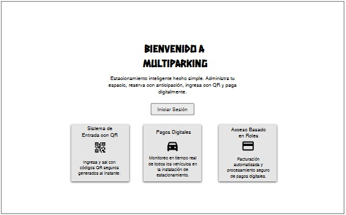
*Nota. Mockup de interfaz — Página de Inicio — MultiParking. Pantalla pública de bienvenida con acceso al inicio de sesión. Presenta las tres características principales del sistema: ingreso con código QR, pagos digitales y acceso diferenciado por roles. Elaboración propia (2026).*

### Figura 6.1.2 — Panel Administrador — Dashboard Principal
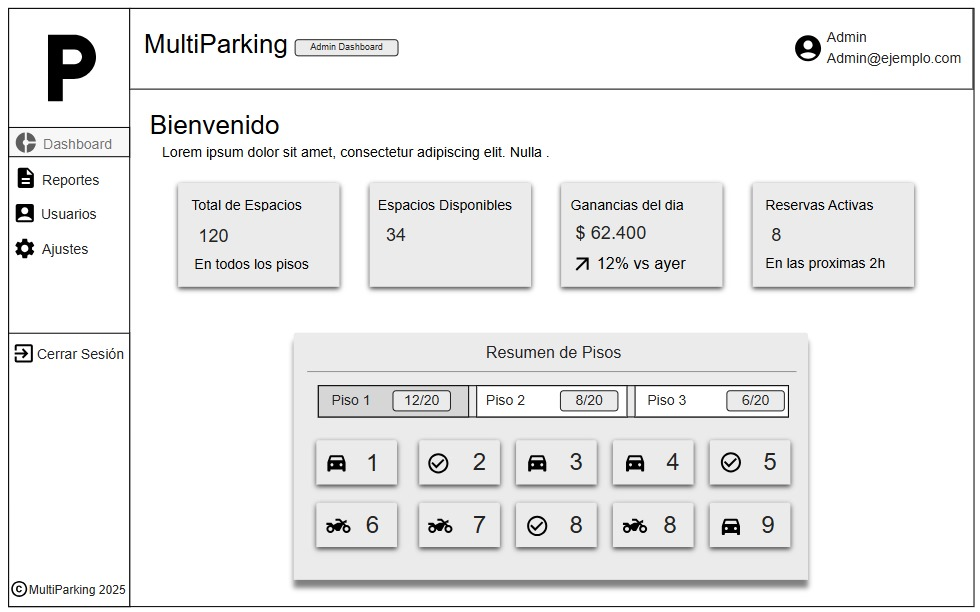
*Nota. Mockup de interfaz — Panel Administrador — Dashboard Principal. Vista principal del administrador con indicadores clave: total de espacios, espacios disponibles, ganancias del día y reservas activas. Incluye resumen de pisos con estado visual de cada espacio. Elaboración propia (2026).*

### Figura 6.1.3 — Panel Administrador — Resumen de Reservas
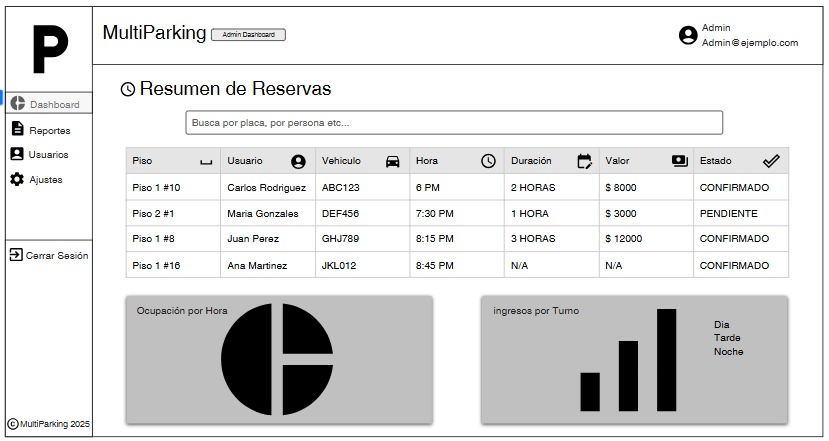
*Nota. Mockup de interfaz — Panel Administrador — Resumen de Reservas. Tabla de reservas activas con piso, usuario, vehículo, hora, duración, valor y estado. Incluye gráficos de ocupación por hora e ingresos por turno. Elaboración propia (2026).*

### Figura 6.1.4 — Panel Vigilante
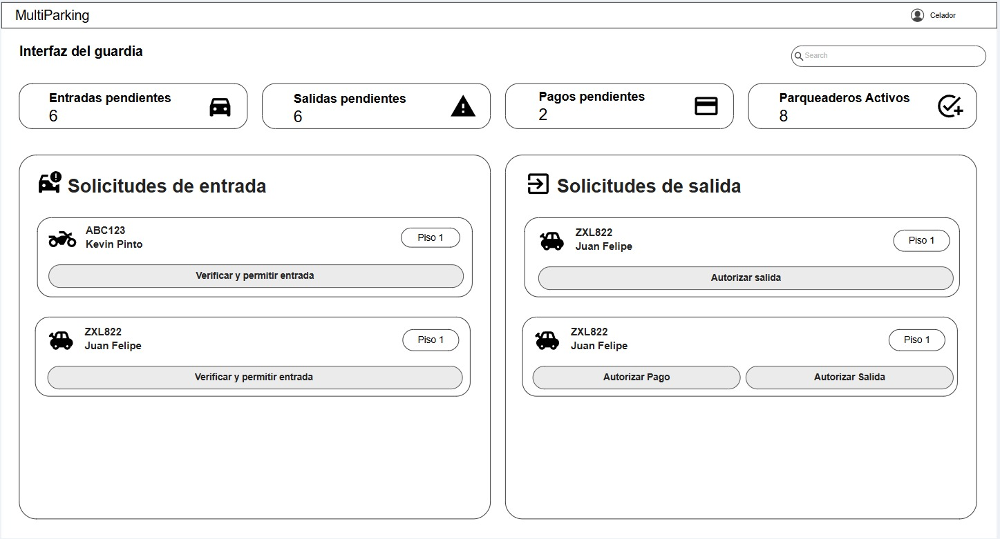
*Nota. Mockup de interfaz — Panel Vigilante. Muestra contadores de entradas, salidas y pagos pendientes. Permite verificar y autorizar solicitudes de entrada, autorizar salidas y pagos de vehículos activos. Elaboración propia (2026).*

### Figura 6.1.5 — Panel Cliente
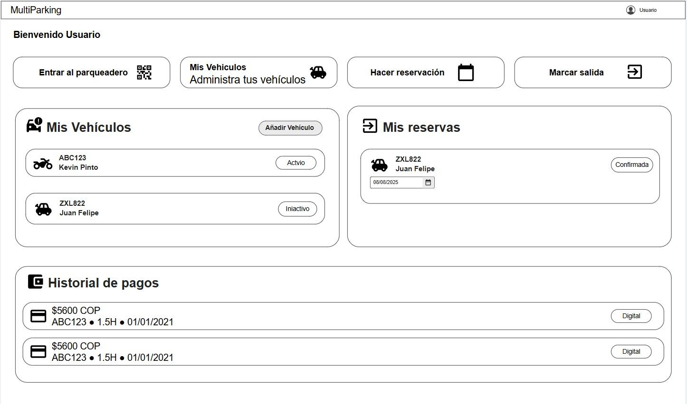
*Nota. Mockup de interfaz — Panel Cliente. Accesos rápidos a ingreso por QR, gestión de vehículos, reservas y salida. Muestra vehículos registrados, reservas activas e historial de pagos. Elaboración propia (2026).*

---

## 6.2 Historias de Usuario

Las historias de usuario del proyecto MultiParking se gestionan en el tablero Trello del equipo, organizadas por sprints de desarrollo. El tablero está disponible en: **https://trello.com/b/nL1GvfLi/multiparking**

El desarrollo se estructuró en 9 sprints (Sprint 0 al Sprint 8), cada uno con tarjetas que representan funcionalidades en formato de historia de usuario: *Como [rol], quiero [acción], para [beneficio]*.

### Tabla HU-01 — Sprints y Módulos Cubiertos en el Tablero Trello

| Sprint | Nombre | Módulos / Funcionalidades | Estado |
|---|---|---|---|
| Sprint 0 | Infraestructura Base | Configuración Django, base de datos, autenticación por sesión, roles | ✅ Completado |
| Sprint 1 | Usuarios, Vehículos y Espacios | CRUD usuarios (3 roles), registro/edición de vehículos y visitantes, pisos y espacios | ✅ Completado |
| Sprint 2 | Inventario, Tarifas, Pagos y Cupones | Registro ingreso/salida, cálculo de tarifas por tipo, creación de pagos, cupones | ✅ Completado |
| Sprint 3 | Finalizado | Integración y pruebas del flujo completo ingreso-salida-pago | ✅ Completado |
| Sprint 4 | Pagos Avanzados y Cupones | Aplicación de cupones al pago, tipos PORCENTAJE y VALOR_FIJO, CuponAplicado | ✅ Completado |
| Sprint 5 | Reservas y Puntos de Fidelidad | Reservas anticipadas, sistema de stickers, reclamación de bono de descuento | ✅ Completado |
| Sprint 6 | Novedades y Reportes | Registro de incidencias con foto, estados de novedad, reportes PDF/Excel | ✅ Completado |
| Sprint 7 | Auditoría, Perfil y UX | Mapa interactivo de espacios, panel cliente, QR de ingreso, mejoras de interfaz | ✅ Completado |
| Sprint 8 | Seguridad, Calidad y Cierre | Middleware de seguridad, validaciones multicapa, pruebas y despliegue en Render | En Progreso |

*Nota. Las historias de usuario detalladas por sprint se encuentran disponibles en el tablero Trello del proyecto: https://trello.com/b/nL1GvfLi/multiparking. Elaboración propia (2026).*

---

## 6.3 Diagrama UML de Casos de Uso

Los diagramas de casos de uso describen las interacciones entre los actores del sistema (Administrador, Vigilante, Cliente/Usuario y Sistema de Correo) y los módulos funcionales. Se presentan 11 diagramas organizados por módulo.

**Actores del sistema:**

| Actor | Descripción |
|---|---|
| Administrador | Gestiona la configuración del parqueadero, usuarios, tarifas, reportes y novedades. |
| Vigilante | Registra ingresos y salidas de vehículos, confirma pagos y reporta novedades. |
| Usuario / Cliente | Usuario registrado que gestiona sus vehículos, reservas y programa de fidelidad. |
| Sistema de Correo | Actor secundario (SendGrid) que envía tokens de recuperación de contraseña. |

### Figura 6.3.1 — Módulo Usuarios
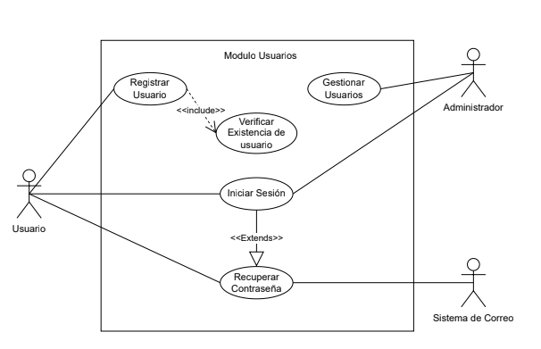
*Nota. Diagrama UML de casos de uso — Módulo Usuarios. Elaboración propia mediante PlantUML (2026).*

### Figura 6.3.2 — Módulo Vehículos
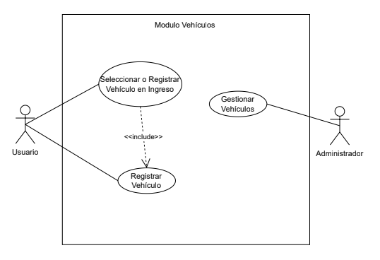
*Nota. Diagrama UML de casos de uso — Módulo Vehículos. Elaboración propia mediante PlantUML (2026).*

### Figura 6.3.3 — Módulo Parqueos (Ingreso)
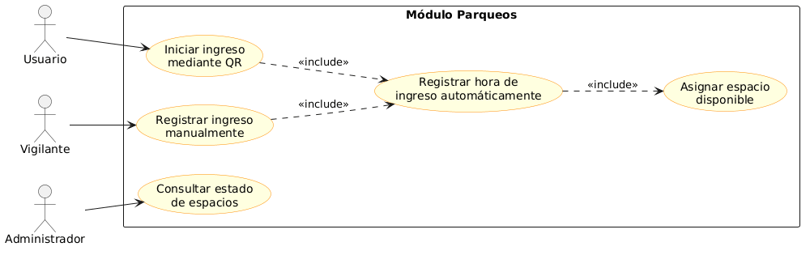
*Nota. Diagrama UML de casos de uso — Módulo Parqueos. Elaboración propia mediante PlantUML (2026).*

### Figura 6.3.4 — Módulo Salida y Pagos
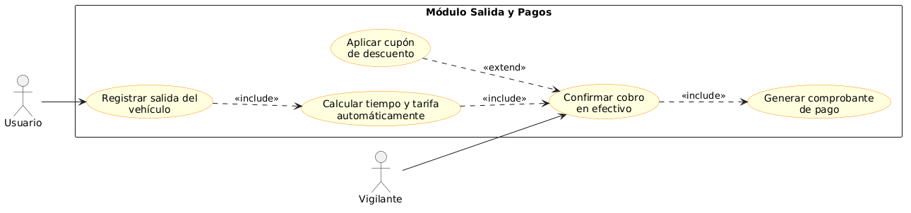
*Nota. Diagrama UML de casos de uso — Módulo Salida y Pagos. Elaboración propia mediante PlantUML (2026).*

### Figura 6.3.5 — Módulo Espacios y Tarifas
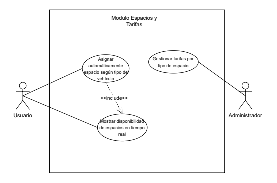
*Nota. Diagrama UML de casos de uso — Módulo Espacios y Tarifas. Elaboración propia mediante PlantUML (2026).*

### Figura 6.3.6 — Módulo Reservas
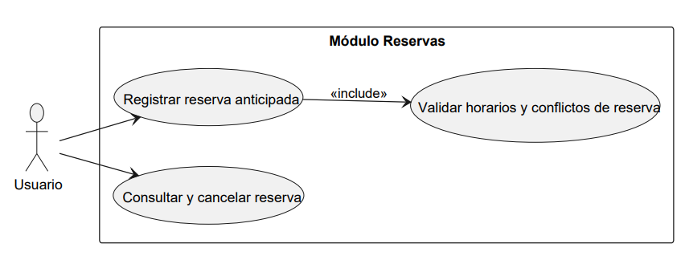
*Nota. Diagrama UML de casos de uso — Módulo Reservas. Elaboración propia mediante PlantUML (2026).*

### Figura 6.3.7 — Módulo Descuentos (Cupones)
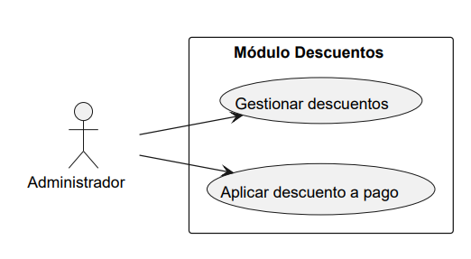
*Nota. Diagrama UML de casos de uso — Módulo Descuentos. Elaboración propia mediante PlantUML (2026).*

### Figura 6.3.8 — Módulo Fidelidad (Stickers)
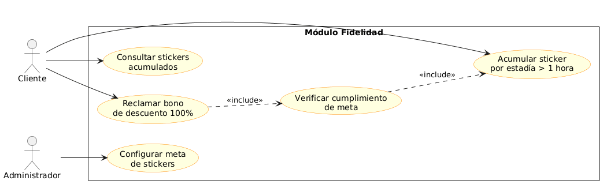
*Nota. Diagrama UML de casos de uso — Módulo Fidelidad. Elaboración propia mediante PlantUML (2026).*

### Figura 6.3.9 — Módulo Novedades
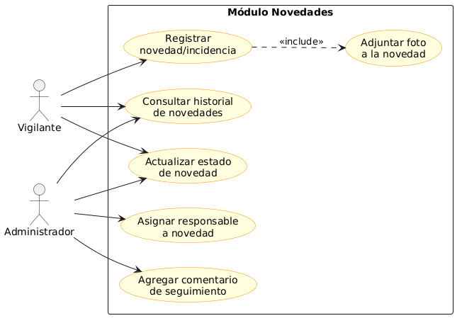
*Nota. Diagrama UML de casos de uso — Módulo Novedades. Elaboración propia mediante PlantUML (2026).*

### Figura 6.3.10 — Módulo Vigilante
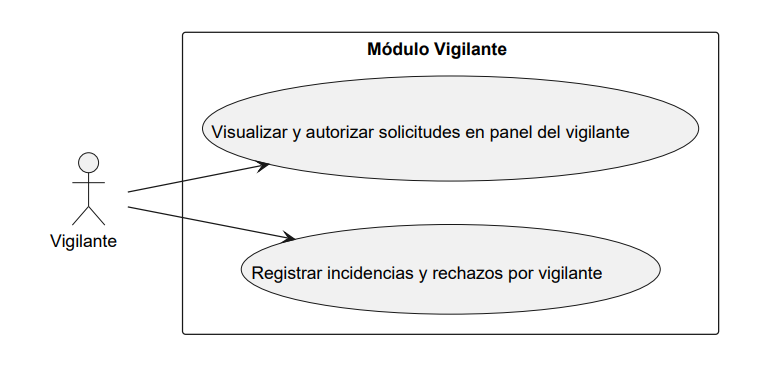
*Nota. Diagrama UML de casos de uso — Módulo Vigilante. Elaboración propia mediante PlantUML (2026).*

### Figura 6.3.11 — Módulo Auditoría y Reportes
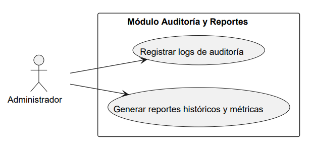
*Nota. Diagrama UML de casos de uso — Módulo Auditoría y Reportes. Elaboración propia mediante PlantUML (2026).*

---

## 6.4 Diagramas de Actividades

Los diagramas de actividades describen el flujo de ejecución de los procesos principales del sistema MultiParking. Se presentan cuatro diagramas que cubren los flujos críticos de negocio.

### Figura 6.4.1 — Registro de Ingreso de Vehículo
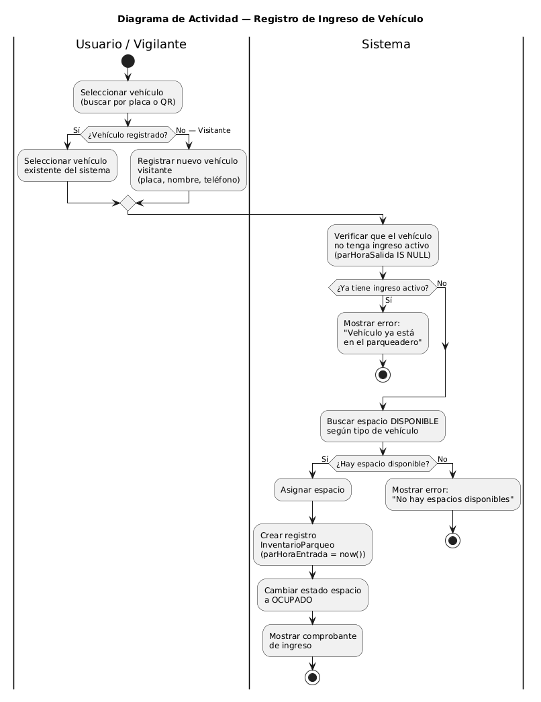
*Nota. Diagrama de actividad UML — Proceso de registro de ingreso de vehículo al parqueadero. Elaboración propia mediante PlantUML (2026).*

**Descripción del flujo:** El vigilante o usuario busca el vehículo por placa o QR. Si no existe en el sistema, se registra como visitante. El sistema verifica que no tenga un ingreso activo y que exista espacio disponible según el tipo de vehículo. Al confirmar, crea el registro `InventarioParqueo` con la hora de entrada y cambia el espacio a OCUPADO.

### Figura 6.4.2 — Registro de Salida y Pago
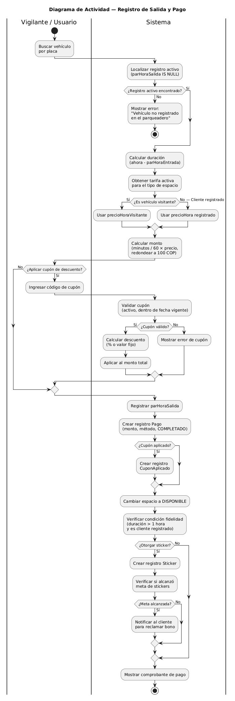
*Nota. Diagrama de actividad UML — Proceso de registro de salida y cobro al vehículo. Elaboración propia mediante PlantUML (2026).*

**Descripción del flujo:** El sistema localiza el registro activo del vehículo, calcula la duración y aplica la tarifa vigente (usando `precioHoraVisitante` para visitantes). Opcionalmente se aplica un cupón. Se registra la hora de salida, se crea el `Pago`, se libera el espacio y se verifica si corresponde otorgar un Sticker de fidelidad. El monto se calcula como `(minutos / 60) × precioHora`, redondeado al múltiplo de 100 COP más cercano.

### Figura 6.4.3 — Proceso de Reserva Anticipada
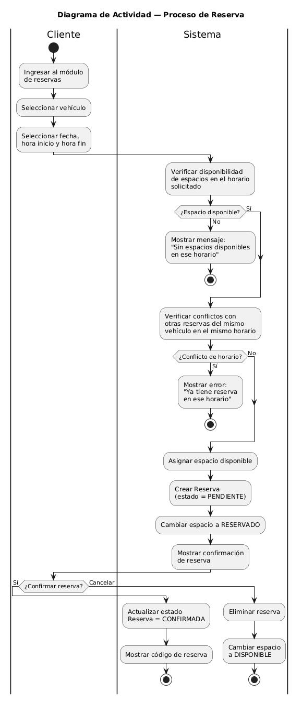
*Nota. Diagrama de actividad UML — Proceso de creación y confirmación de reserva anticipada. Elaboración propia mediante PlantUML (2026).*

**Descripción del flujo:** El cliente selecciona su vehículo y el horario deseado. El sistema verifica disponibilidad de espacios y detecta conflictos con otras reservas del mismo vehículo. Al no haber conflictos, crea la `Reserva` en estado PENDIENTE y el cliente puede confirmarla (cambia a CONFIRMADA, espacio a RESERVADO) o cancelarla (libera el espacio).

### Figura 6.4.4 — Reclamar Bono de Fidelidad
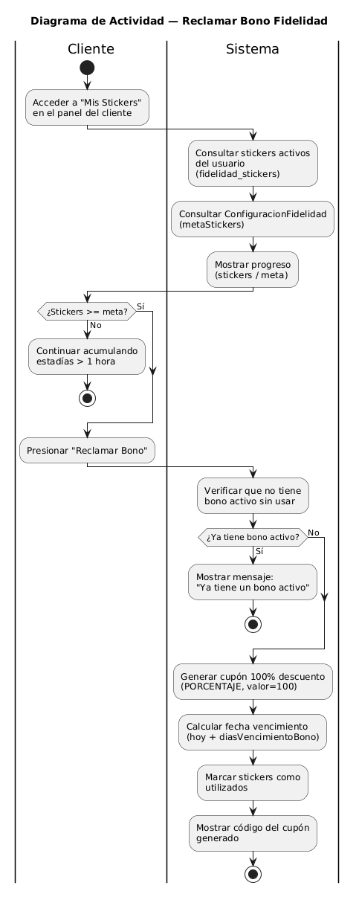
*Nota. Diagrama de actividad UML — Proceso de reclamación de bono de fidelidad por acumulación de stickers. Elaboración propia mediante PlantUML (2026).*

**Descripción del flujo:** El cliente consulta sus stickers acumulados. Si ha alcanzado la `metaStickers` configurada por el administrador y no tiene un bono activo sin usar, puede reclamar un cupón de descuento del 100% con vigencia de `diasVencimientoBono` días a partir de la fecha de reclamación.

---

## 6.5 Diagramas de Secuencias

Los diagramas de secuencias muestran la interacción temporal entre los objetos del sistema para los flujos más representativos.

### Figura 6.5.1 — Secuencia: Inicio de Sesión
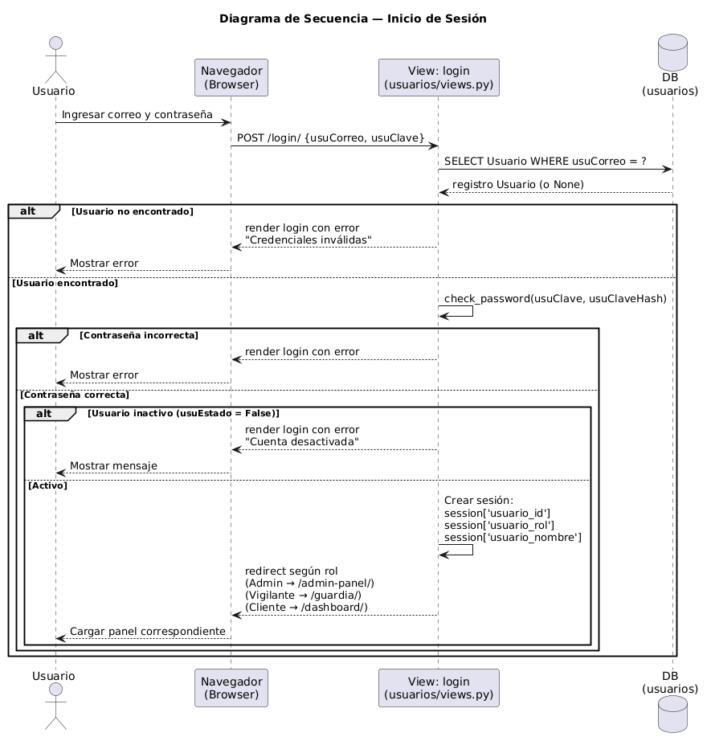
*Nota. Diagrama de secuencia UML — Proceso de autenticación de usuario en el sistema. Elaboración propia mediante PlantUML (2026).*

**Descripción:** El usuario envía sus credenciales vía `POST /login/`. La vista `login` en `usuarios/views.py` consulta la base de datos por el correo, verifica la contraseña con `check_password()`, valida el estado de la cuenta y crea la sesión Django con las claves `usuario_id`, `usuario_rol` y `usuario_nombre`. La redirección final depende del rol: `ADMIN → /admin-panel/`, `VIGILANTE → /guardia/`, `CLIENTE → /dashboard/`.

### Figura 6.5.2 — Secuencia: Registro de Ingreso y Salida con Pago
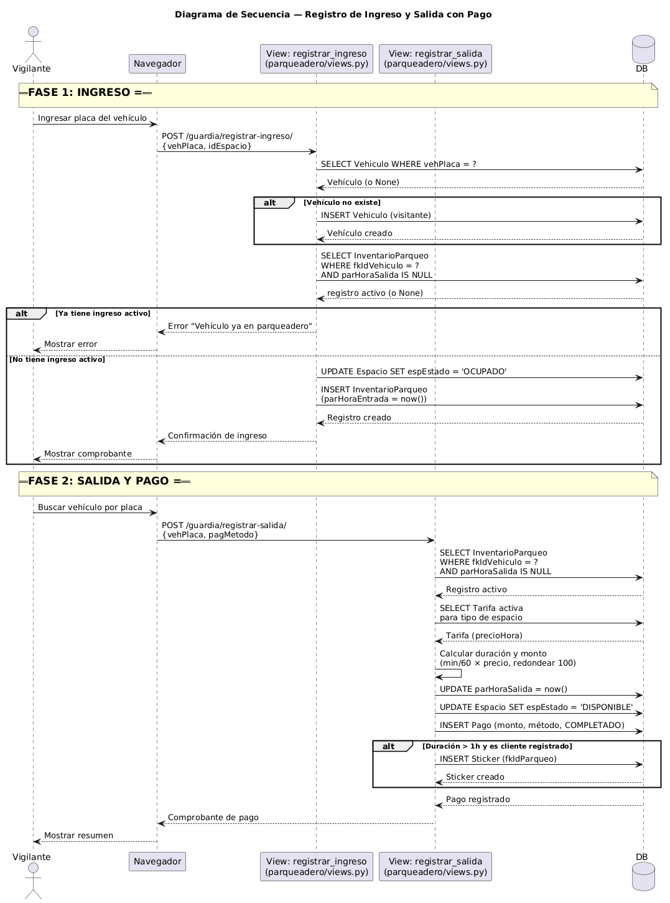
*Nota. Diagrama de secuencia UML — Proceso completo de ingreso y salida de vehículo con registro de pago. Elaboración propia mediante PlantUML (2026).*

**Descripción:** El diagrama muestra dos fases secuenciales. En la **Fase 1 (Ingreso)**, la vista `registrar_ingreso` en `parqueadero/views.py` busca el vehículo por placa, verifica que no tenga un ingreso activo (`parHoraSalida IS NULL`), actualiza el estado del espacio a OCUPADO y crea el `InventarioParqueo`. En la **Fase 2 (Salida)**, la vista `registrar_salida` localiza el registro activo, obtiene la tarifa vigente, calcula el monto, registra la hora de salida, libera el espacio y crea el `Pago`. Si la estadía supera 1 hora y el vehículo pertenece a un cliente registrado, crea además un `Sticker`.

---

## 6.6 Modelo de Dominio (Diagrama de Clases)

El modelo de dominio representa las entidades principales del sistema MultiParking, sus atributos y las relaciones entre ellas. Corresponde directamente a los modelos Django definidos en cada aplicación del proyecto.

### Figura 6.6.1 — Diagrama de Clases — Modelo de Dominio MultiParking
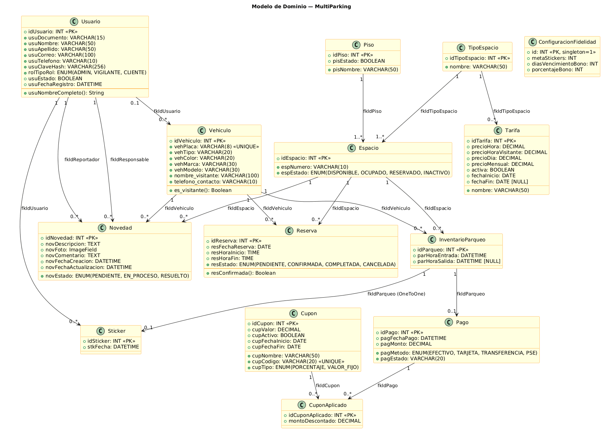
*Nota. Diagrama UML de clases — Modelo de dominio completo del sistema MultiParking. Incluye los 14 modelos Django con sus atributos y relaciones. Elaboración propia mediante PlantUML (2026).*

**Descripción de las relaciones principales:**

| Relación | Tipo | Descripción |
|---|---|---|
| Usuario → Vehiculo | 1 a N (opcional) | Un usuario puede tener muchos vehículos. Los vehículos visitantes tienen fkIdUsuario = NULL. |
| Vehiculo → InventarioParqueo | 1 a N | Cada vehículo puede tener múltiples registros históricos de parqueo. Solo uno puede estar activo (parHoraSalida IS NULL). |
| Espacio → InventarioParqueo | 1 a N | Un espacio puede tener múltiples registros históricos. Solo uno activo a la vez. |
| Piso → Espacio | 1 a N | Cada piso contiene múltiples espacios físicos. |
| TipoEspacio → Espacio | 1 a N | Cada espacio tiene un tipo (moto, carro, etc.). |
| TipoEspacio → Tarifa | 1 a N | Cada tipo de espacio tiene su tarifa. Solo una activa por tipo a la vez. |
| InventarioParqueo → Pago | 1 a 1 (opcional) | Cada registro de parqueo completado genera un pago. |
| Pago → CuponAplicado | 1 a N | Un pago puede tener cupones aplicados (generalmente uno). |
| Cupon → CuponAplicado | 1 a N | Un cupón puede usarse en múltiples pagos. |
| Espacio → Reserva | 1 a N | Un espacio puede tener múltiples reservas en diferentes horarios. |
| Vehiculo → Reserva | 1 a N | Un vehículo puede tener múltiples reservas. |
| InventarioParqueo → Sticker | 1 a 1 | Por cada estadía > 1 hora se genera exactamente un sticker (OneToOneField). |
| Usuario → Sticker | 1 a N | Un usuario acumula múltiples stickers a lo largo del tiempo. |
| Usuario → Novedad | 1 a N (reportador/responsable) | El vigilante reporta novedades; el admin las gestiona. |

**Propiedades derivadas (no almacenadas en BD):**

| Propiedad | Clase | Descripción |
|---|---|---|
| `usuNombreCompleto` | Usuario | `usuNombre + " " + usuApellido` |
| `es_visitante` | Vehiculo | `True` cuando `fkIdUsuario` es NULL |
| `resConfirmada` | Reserva | `True` cuando `resEstado == "CONFIRMADA"` |
