# Manual de Usuario — Rol Administrador

**Sistema:** MultiParking — Gestión Integral de Parqueaderos Privados
**Versión del manual:** 1.0
**Fecha:** 18 de agosto de 2026
**Rol documentado:** Administrador (`rolTipoRol = ADMIN`)
**Experiencia documentada:** Escritorio (desktop, 1440×900) — ver nota en la sección "Diferencias con otros roles"

---

## Índice

1. [Introducción](#1-introducción)
2. [Acceso al sistema](#2-acceso-al-sistema)
3. [Interfaz principal](#3-interfaz-principal)
4. [Funcionalidades](#4-funcionalidades)
   - [4.1 Pisos](#41-pisos)
   - [4.2 Tipos de Espacio](#42-tipos-de-espacio)
   - [4.3 Espacios](#43-espacios)
   - [4.4 Tarifas](#44-tarifas)
   - [4.5 Cupones](#45-cupones)
   - [4.6 Vehículos](#46-vehículos)
   - [4.7 Reservas](#47-reservas)
   - [4.8 Novedades](#48-novedades)
   - [4.9 Fidelidad](#49-fidelidad)
   - [4.10 Inventario](#410-inventario)
   - [4.11 Pagos](#411-pagos)
   - [4.12 Reportes](#412-reportes)
   - [4.13 Usuarios](#413-usuarios)
   - [4.14 Código QR](#414-código-qr)
   - [4.15 Prueba de Correos](#415-prueba-de-correos)
5. [Flujos completos](#5-flujos-completos)
6. [Errores y problemas frecuentes](#6-errores-y-problemas-frecuentes)
7. [Buenas prácticas](#7-buenas-prácticas)
8. [Preguntas frecuentes](#8-preguntas-frecuentes)
9. [Glosario](#9-glosario)

---

## 1. Introducción

**MultiParking** es un sistema web para la administración integral de parqueaderos privados: control de pisos y espacios, tarifas, pagos, cupones, reservas, vehículos, novedades operativas y un programa de fidelidad por stickers.

Este manual está dirigido al rol **Administrador**, el único rol con acceso completo al panel `/admin-panel/`. El administrador es responsable de configurar la estructura física del parqueadero (pisos, tipos de espacio, espacios), las reglas de negocio (tarifas, cupones, fidelidad), y de supervisar la operación diaria (inventario, pagos, reservas, novedades, usuarios, reportes).

Un administrador puede hacer todo lo que puede hacer un vigilante o un cliente, y además gestionar la configuración global del sistema. No tiene acceso a las vistas exclusivas de cliente (`/cliente/...` de autoservicio) desde el panel de administrador — esas se gestionan desde la sección "Vehículos" y "Reservas" del propio panel admin, con alcance sobre todos los usuarios.

## 2. Acceso al sistema

### 2.1 Iniciar sesión

1. Ir a `https://multiparking-django.onrender.com/login/`.
2. Completar **Correo electrónico** y **Contraseña**.
3. Pulsar **Iniciar Sesión**.

*1: Campo de correo. 2: Campo de contraseña. 3: Botón que envía el formulario.*

Credenciales de administrador de prueba: `admin@multiparking.com` / `admin123`.

Al autenticar correctamente, el sistema redirige automáticamente a `/admin-panel/` (Panel Principal) si el usuario tiene rol `ADMIN`.

### 2.2 Recuperar contraseña

Desde el enlace **¿Olvidaste tu contraseña?** en la pantalla de login se accede a `/password-reset/`, donde se solicita el correo registrado. El sistema envía un enlace de recuperación de un solo uso por correo (Resend o SendGrid, según configuración). El enlace incluye un token que se invalida automáticamente al cambiar la contraseña.

### 2.3 Errores comunes al iniciar sesión

| Situación | Causa | Qué hacer |
|---|---|---|
| "Credenciales inválidas" | Correo o contraseña incorrectos | Verificar mayúsculas/minúsculas; usar recuperación de contraseña |
| Redirige de nuevo al login tras enviar | Cuenta desactivada (`usuEstado = False`) | Contactar a otro administrador para reactivar la cuenta desde Usuarios |
| No llega el correo de recuperación | Proveedor de correo mal configurado o correo en spam | Revisar carpeta de spam; un administrador puede verificar el estado del proveedor en "Prueba de Correos" |

## 3. Interfaz principal

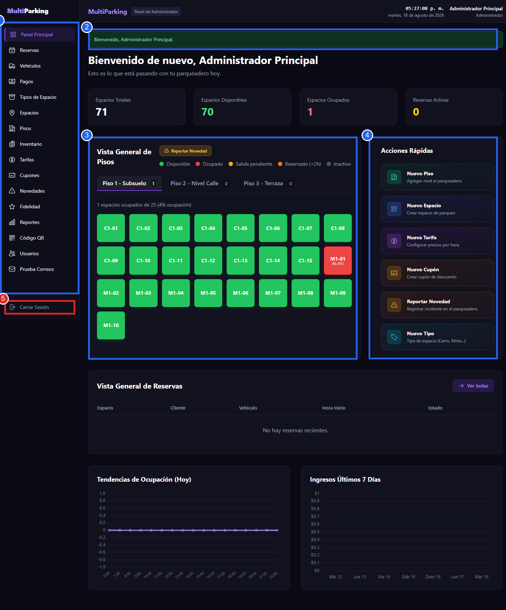

*1: Menú lateral con todas las secciones del panel. 2: Banner de confirmación (aparece tras crear/editar/eliminar algo). 3: Vista general de pisos — mapa de ocupación en tiempo real por espacio, con pestañas por piso. 4: Acciones rápidas — accesos directos a los formularios de creación más usados. 5: Cerrar sesión.*

El Panel Principal (`/admin-panel/`) muestra:

- **Tarjetas de resumen**: Espacios Totales, Espacios Disponibles, Espacios Ocupados, Reservas Activas.
- **Vista General de Pisos**: mapa visual de espacios coloreado por estado (verde = Disponible, rojo = Ocupado, ámbar = Salida pendiente, naranja = Reservado <2h, gris = Inactivo). Los espacios ocupados muestran la placa del vehículo. Se actualiza automáticamente.
- **Acciones Rápidas**: enlaces directos a Nuevo Piso, Nuevo Espacio, Nueva Tarifa, Nuevo Cupón, Reportar Novedad, Nuevo Tipo.
- **Vista General de Reservas**: tabla con las reservas más próximas (espacio, cliente, vehículo, hora de inicio, estado).
- **Gráficas**: Tendencias de Ocupación (hoy, por hora) e Ingresos Últimos 7 Días (Chart.js).

El menú lateral izquierdo es fijo y agrupa: Panel Principal, Reservas, Vehículos, Pagos, Tipos de Espacio, Espacios, Pisos, Inventario, Tarifas, Cupones, Novedades, Fidelidad, Reportes, Código QR, Usuarios, Prueba Correos, y Cerrar Sesión al final.

## 4. Funcionalidades

### 4.1 Pisos

**Qué hace:** gestiona los niveles físicos del parqueadero (ej. "Piso 1 - Subsuelo"). Los pisos no tienen tarifa propia — únicamente agrupan espacios.
**Para qué sirve:** organizar los espacios por nivel y ver ocupación agregada por piso.
**Cuándo usarla:** al dar de alta un nuevo nivel del parqueadero, o al desactivar uno temporalmente.
**Cómo acceder:** menú lateral → **Pisos**, o `/admin-panel/pisos/`.

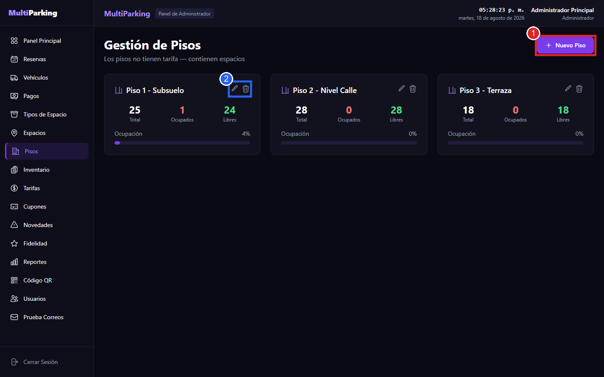

*1: Botón "Nuevo Piso". 2: Iconos de editar (lápiz) y eliminar (papelera) sobre cada tarjeta de piso.*

Cada tarjeta muestra: nombre del piso, Total de espacios, Ocupados, Libres, y una barra de % de Ocupación.

#### Crear un piso

1. Clic en **Nuevo Piso** (`/admin-panel/pisos/crear/`).
2. Completar **Nombre del Piso** (texto libre, ej. "Piso 1 - Subterráneo").
3. El interruptor **Piso Activo** viene encendido por defecto.
4. Clic en **Guardar**.

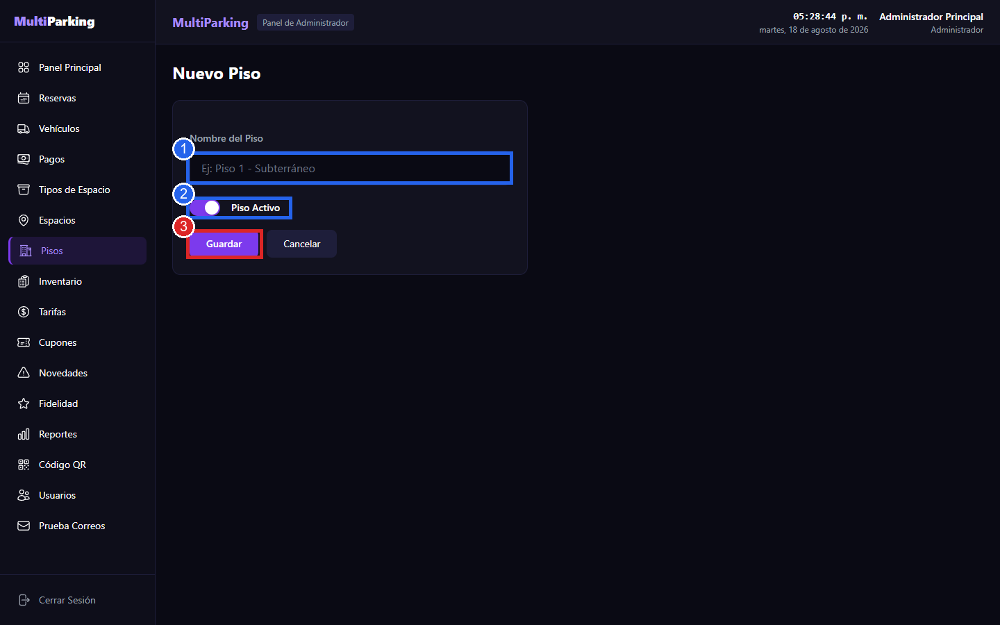

*1: Campo Nombre del Piso. 2: Interruptor Piso Activo. 3: Botón Guardar (Cancelar regresa al listado sin guardar).*

**Resultado esperado:** banner verde "Piso creado exitosamente." y el nuevo piso aparece de inmediato en el listado, con 0 espacios.

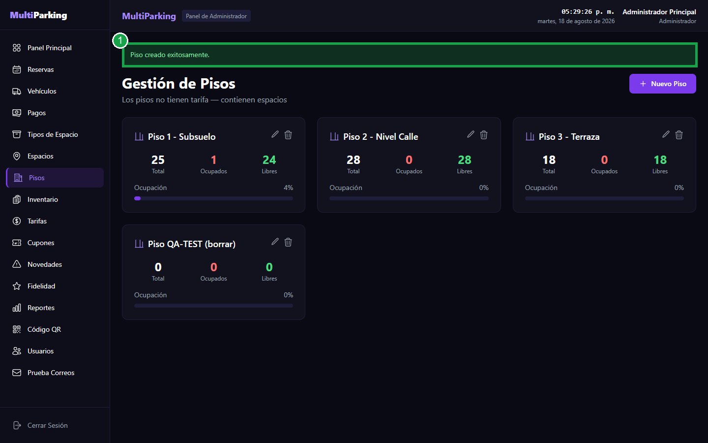

*1: Mensaje de confirmación tras guardar.*

**Verificado en vivo:** se creó un piso de prueba ("Piso QA-TEST (borrar)"), apareció correctamente en el listado con contadores en 0, y se eliminó sin dejar rastro (ver más abajo).

#### Editar un piso

Clic en el ícono de lápiz de la tarjeta → abre el mismo formulario que "Nuevo Piso" pero con el nombre actual precargado y el estado real del interruptor **Piso Activo**. Al desactivar un piso (interruptor apagado) sus espacios dejan de poder recibir nuevos ingresos, pero el piso y su historial no se eliminan.

#### Eliminar un piso

1. Clic en el ícono de papelera de la tarjeta.
2. El navegador muestra un **diálogo de confirmación nativo**: "¿Eliminar este piso?".
3. Aceptar para confirmar.

**Resultado esperado:** banner "Piso eliminado." y la tarjeta desaparece del listado.

**Regla de negocio verificada:** un piso con espacios **ocupados** no debería poder eliminarse (regla documentada en el proyecto: *"Pisos con espacios ocupados no pueden eliminarse"*). No se forzó esta condición en producción para no afectar el demo en vivo; queda documentada como comportamiento esperado según el código, no verificado interactivamente en este pase.

### 4.2 Tipos de Espacio

**Qué hace:** define las categorías de espacio (ej. Carro, Moto) que luego se asignan a cada espacio físico y a cada tarifa.
**Para qué sirve:** permitir tarifas y reglas diferenciadas según el tipo de vehículo.
**Cuándo usarla:** al necesitar una nueva categoría de vehículo distinta a las existentes.
**Cómo acceder:** menú lateral → **Tipos de Espacio**, o `/admin-panel/tipos-espacio/`.

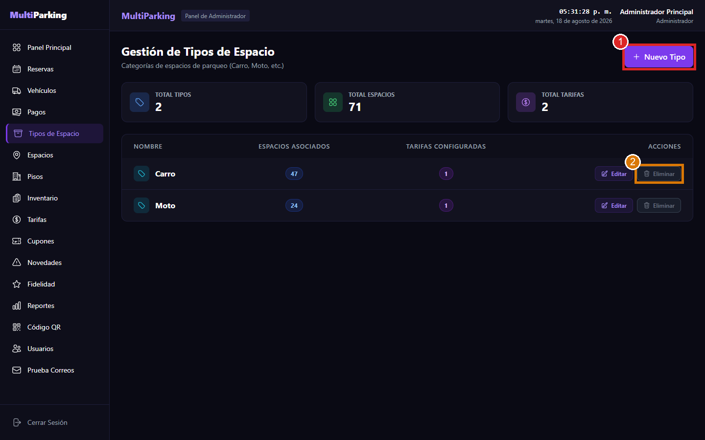

*1: Botón "Nuevo Tipo". 2: Botón "Eliminar" — aparece deshabilitado (gris) cuando el tipo tiene espacios asociados, como es el caso de "Carro" (47 espacios).*

La tabla muestra, por tipo: Nombre, cantidad de Espacios Asociados, Tarifas Configuradas, y acciones Editar/Eliminar. Tres tarjetas de resumen arriba muestran Total Tipos, Total Espacios y Total Tarifas del sistema completo.

#### Crear un tipo de espacio

1. Clic en **Nuevo Tipo** (`/admin-panel/tipos-espacio/crear/`).
2. Completar **Nombre del Tipo** (texto libre, ej. "Bicicleta").
3. Clic en **Guardar**.

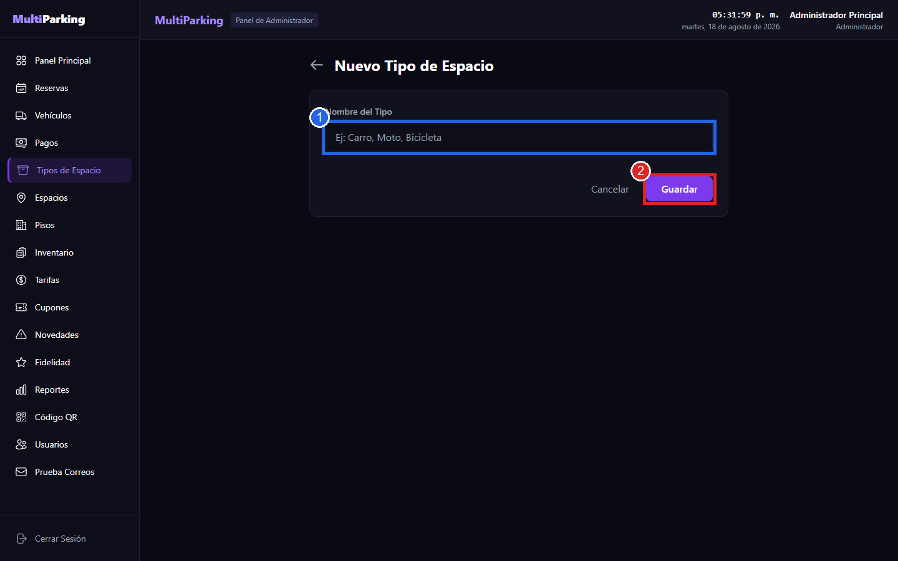

*1: Campo Nombre del Tipo. 2: Botón Guardar.*

**Resultado esperado:** banner "Tipo de espacio creado exitosamente." y el nuevo tipo aparece en la tabla con 0 espacios y 0 tarifas asociadas, y con el botón **Eliminar habilitado** (a diferencia de los tipos ya en uso).

**Verificado en vivo:** se creó "QA-TEST (borrar)", apareció con 0/0 y Eliminar habilitado; al eliminarlo, el diálogo de confirmación mostró textualmente: *"¿Eliminar tipo QA-TEST (borrar)? Solo es posible si no tiene espacios asociados."* — confirmando en el propio mensaje la regla de negocio. Se aceptó el diálogo y el tipo se eliminó correctamente, dejando la tabla igual que al inicio (Carro, Moto).

#### Editar un tipo de espacio

Clic en **Editar** en la fila correspondiente → mismo formulario que "Nuevo Tipo", con el nombre actual precargado.

#### Eliminar un tipo de espacio

Disponible solo si **Espacios Asociados = 0**. Si el tipo está en uso, el botón aparece deshabilitado y no es posible hacer clic. Esto evita romper la relación entre espacios/tarifas existentes y su tipo.

### 4.3 Espacios

**Qué hace:** gestiona los espacios físicos individuales de parqueo (ej. "C1-01"), cada uno asociado a un Piso y a un Tipo de Espacio, con un Estado (Disponible, Ocupado, Reservado, Inactivo).
**Cómo acceder:** menú lateral → **Espacios**, o `/admin-panel/espacios/`.

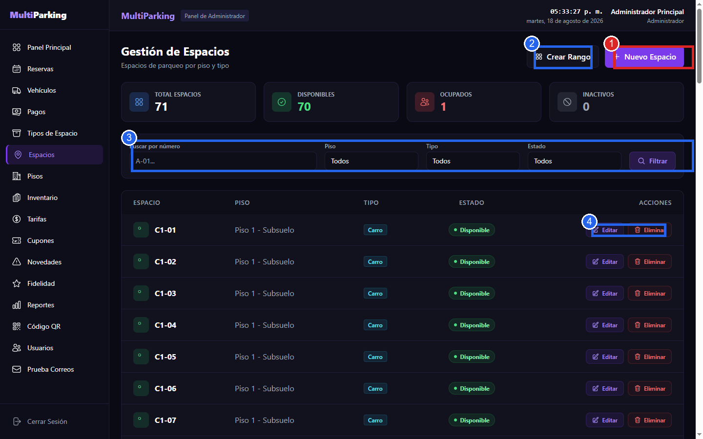

*1: Botón "Nuevo Espacio" (crea uno a la vez). 2: Botón "Crear Rango" (crea varios espacios consecutivos de una vez). 3: Filtros — Buscar por número, Piso, Tipo, Estado. 4: Acciones Editar/Eliminar por fila.*

Tarjetas de resumen: Total Espacios, Disponibles, Ocupados, Inactivos. La tabla es paginada y muestra Espacio, Piso, Tipo, Estado y Acciones.

#### Crear un espacio individual

1. Clic en **Nuevo Espacio** (`/admin-panel/espacios/crear/`).
2. Completar **Número / Código** (ej. "A-01").
3. Seleccionar **Piso** y **Tipo de Espacio** (listas desplegables con los pisos/tipos ya creados).
4. Seleccionar **Estado** (por defecto "Disponible").
5. Clic en **Guardar**.

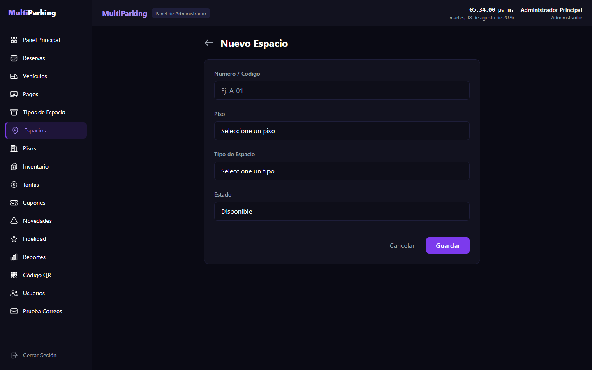

#### Crear varios espacios a la vez (rango)

Herramienta pensada para dar de alta un piso completo sin repetir el formulario espacio por espacio.

1. Clic en **Crear Rango** (`/admin-panel/espacios/rango/`).
2. Completar **Prefijo** (ej. "A-"), **Número Inicio** (ej. 1) y **Número Fin** (ej. 20).
3. Seleccionar **Piso** y **Tipo de Espacio** (aplican a todos los espacios generados).
4. Clic en **Generar Espacios**.

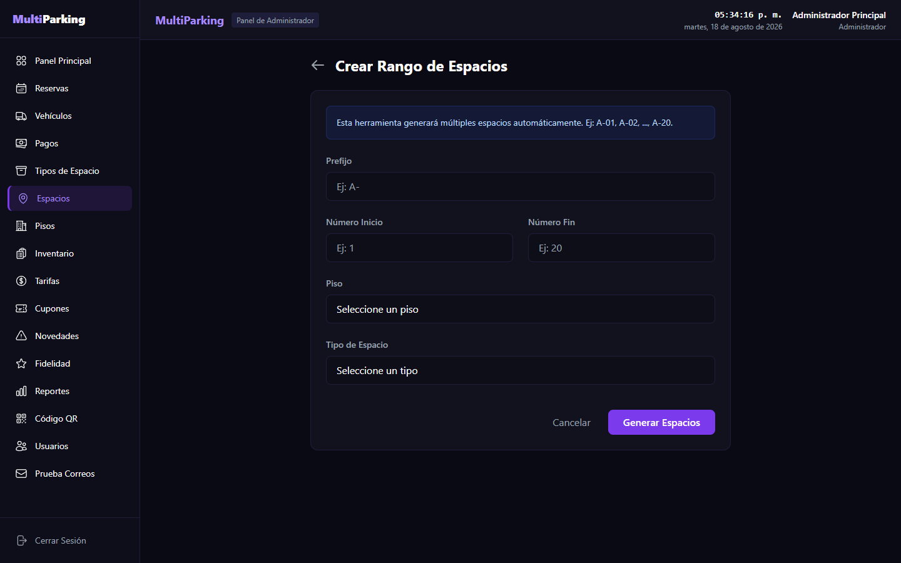

**Resultado esperado:** se crean automáticamente los espacios A-01, A-02, …, A-20 en el piso y tipo seleccionados. El propio formulario indica el patrón esperado: *"Esta herramienta generará múltiples espacios automáticamente. Ej: A-01, A-02, …, A-20."*

**Nota:** no se ejecutó esta creación masiva en el entorno en vivo para no inflar artificialmente el inventario del demo público; el flujo se documentó leyendo el formulario real y su texto de ayuda, no fue ejecutado de punta a punta en este pase.

#### Editar y eliminar un espacio

**Editar** abre el mismo formulario que "Nuevo Espacio" con los valores actuales cargados — útil para, por ejemplo, marcar un espacio como "Inactivo" (mantenimiento) sin eliminarlo.

**Eliminar** muestra un diálogo de confirmación nativo. Según la regla de negocio del sistema, un espacio con un parqueo activo (vehículo actualmente adentro) no debe poder eliminarse; no se forzó este caso en el demo en vivo por no contar con un espacio ocupado disponible para la prueba sin afectar el estado real del demo.

### 4.4 Tarifas

**Qué hace:** define el precio por tipo de espacio: por hora (usuario registrado), por hora (visitante), por día y por mes, con vigencia por fechas.
**Cómo acceder:** menú lateral → **Tarifas**, o `/admin-panel/tarifas/`.

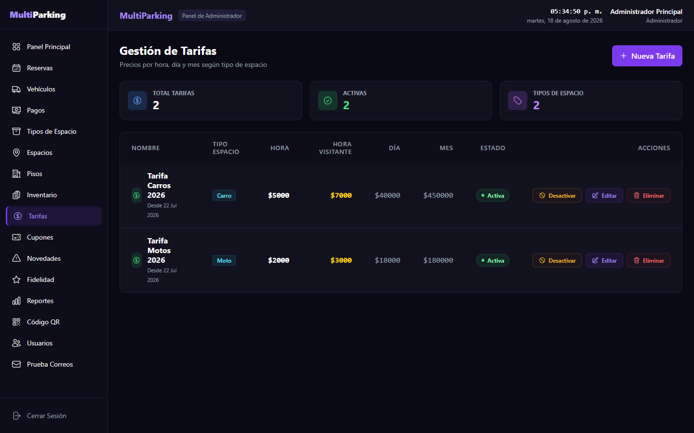

La tabla muestra, por tarifa: Nombre, Tipo de Espacio, precio por Hora, Hora Visitante, Día, Mes, Estado (Activa/Inactiva) y acciones **Desactivar**, **Editar**, **Eliminar**. En el demo hay dos tarifas activas: "Tarifa Carros 2026" ($5.000/h, $7.000/h visitante, $40.000/día, $450.000/mes) y "Tarifa Motos 2026" ($2.000/h, $3.000/h visitante, $18.000/día, $180.000/mes).

#### Crear una tarifa

1. Clic en **Nueva Tarifa** (`/admin-panel/tarifas/crear/`).
2. Completar los campos obligatorios (marcados con `*`): **Nombre de la Tarifa**, **Para Tipo de Vehículo**, **Precio Hora (Usuario)**, **Precio Día**, **Precio Mensual**, **Fecha Inicio**.
3. **Precio Hora (Visitante)** es opcional: si se deja en 0, el sistema usa automáticamente el mismo precio que el de Usuario (el formulario lo indica explícitamente: *"Si es 0, se usa el precio hora normal para visitantes"*).
4. **Fecha Fin** es opcional (tarifa indefinida si se deja vacía).
5. El interruptor **Tarifa Activa** decide si queda vigente de inmediato.
6. Clic en **Guardar Tarifa**.

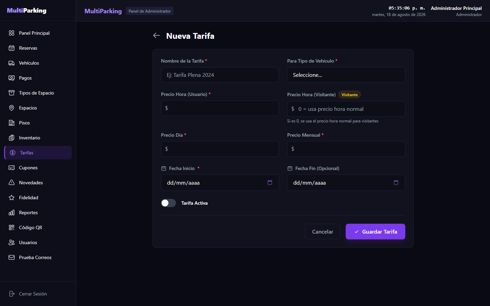

**Regla de negocio (documentada en el código, no forzada en el demo en vivo):** solo puede haber una tarifa activa por tipo de espacio a la vez — al activar una tarifa nueva para "Carro", el sistema debe desactivar automáticamente la tarifa "Carro" previamente activa. No se ejecutó esta prueba en producción porque hacerlo desactivaría la tarifa real "Tarifa Carros 2026" que usa el demo en vivo para calcular costos frente a otros visitantes.

#### Desactivar / Editar / Eliminar una tarifa

- **Desactivar**: cambia el estado a inactiva sin borrar el historial de pagos que la usaron.
- **Editar**: mismo formulario que "Nueva Tarifa", precargado.
- **Eliminar**: según la regla de negocio, no debería ser posible eliminar una tarifa con parqueos/pagos asociados (para no perder la trazabilidad de cobros históricos).

### 4.5 Cupones

**Qué hace:** administra cupones de descuento (porcentaje o valor fijo) identificados por un código único.
**Cómo acceder:** menú lateral → **Cupones**, o `/admin-panel/cupones/`.

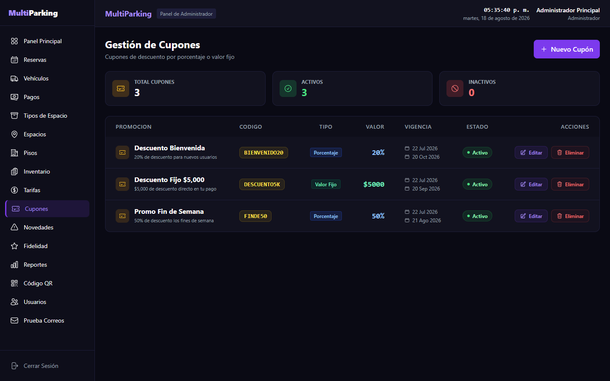

Tarjetas de resumen: Total Cupones, Activos, Inactivos. La tabla muestra Promoción (con descripción), Código, Tipo (Porcentaje/Valor Fijo), Valor, Vigencia (fecha inicio–fin) y Estado.

#### Crear un cupón

1. Clic en **Nuevo Cupón** (`/admin-panel/cupones/crear/`).
2. Completar **Nombre de la Promoción**, **Código del Cupón** (único — el formulario lo marca con la etiqueta "Único"; es el código que el cliente digita para aplicar el descuento).
3. Elegir **Tipo de Descuento**: Porcentaje (%) o Valor Fijo ($).
4. Completar **Valor del Descuento** (número).
5. **Descripción** es opcional.
6. Completar **Fecha Inicio** y **Fecha Fin** (ambas obligatorias, a diferencia de Tarifas donde Fecha Fin es opcional).
7. Marcar la casilla **Cupón Activo** si debe quedar disponible de inmediato.
8. Clic en **Guardar Cupón**.

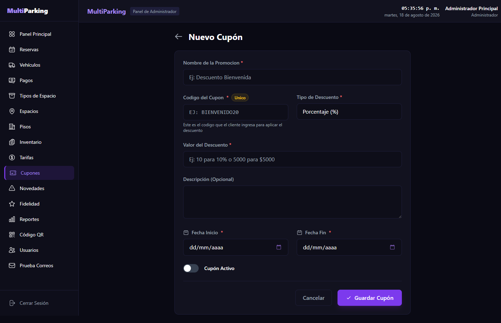

**Verificado en vivo:** se creó el cupón "QA TEST borrar" (código `QATEST99`, 10%, vigencia 18–19 ago 2026) **sin marcar la casilla "Cupón Activo"**. Tras guardar, apareció banner "Cupón creado exitosamente." y la fila del cupón mostró correctamente **Estado: Inactivo** — confirma que la casilla controla el campo `cupActivo` tal como se espera. Se eliminó después con el diálogo de confirmación *"¿Eliminar cupón QA TEST borrar?"*, quedando el listado igual que al inicio (3 cupones activos: BIENVENIDO20, DESCUENTO5K, FINDE50).

#### Editar / Eliminar un cupón

**Editar** abre el mismo formulario precargado. **Eliminar** pide confirmación nativa del navegador; según la regla de negocio, un cupón que ya fue aplicado en algún pago queda registrado en `CuponAplicado` con el monto descontado, por lo que su historial de uso se conserva aunque el cupón se elimine o desactive.

### 4.6 Vehículos

**Qué hace:** administra todos los vehículos registrados en el sistema, tanto de clientes con cuenta como de visitantes sin cuenta.
**Cómo acceder:** menú lateral → **Vehículos**, o `/admin-panel/vehiculos/`.

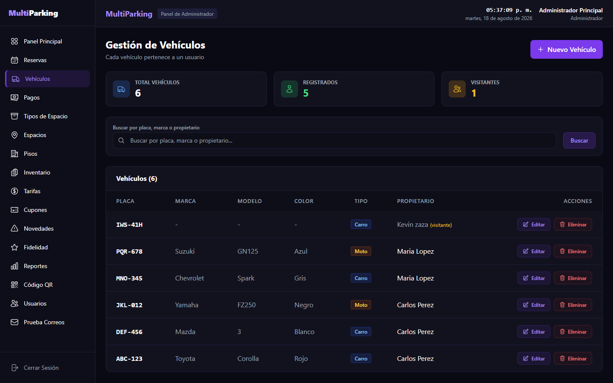

Tarjetas de resumen: Total Vehículos, Registrados (con propietario), Visitantes (sin cuenta). Buscador por placa, marca o propietario. La tabla muestra Placa, Marca, Modelo, Color, Tipo, Propietario y Acciones. Los vehículos de visitante se distinguen porque el Propietario aparece con la etiqueta **"(visitante)"** junto al nombre de contacto, y Marca/Modelo/Color aparecen como "-" si no se completaron.

#### Crear un vehículo

1. Clic en **Nuevo Vehículo** (`/admin-panel/vehiculos/crear/`).
2. Completar **Placa** (el guion se inserta automáticamente al escribir, según indica el propio formulario).
3. **Marca**, **Modelo** y **Color** son opcionales.
4. Elegir **Tipo** (Carro, Moto, etc. — viene de Tipos de Espacio).
5. El interruptor **Vehículo activo** viene encendido; el formulario aclara: *"Los vehículos inactivos no pueden ingresar al parqueadero"*.
6. En **Propietario (usuario registrado)**: elegir un usuario de la lista, o dejar **"Sin propietario (visitante)"**.
7. Si se deja como visitante, aparece un bloque **Datos de Contacto (Visitante)** con **Nombre** y **Teléfono** del contacto — corresponde a `nombre_visitante`/`telefono_contacto` en el modelo.
8. Clic en **Guardar**.

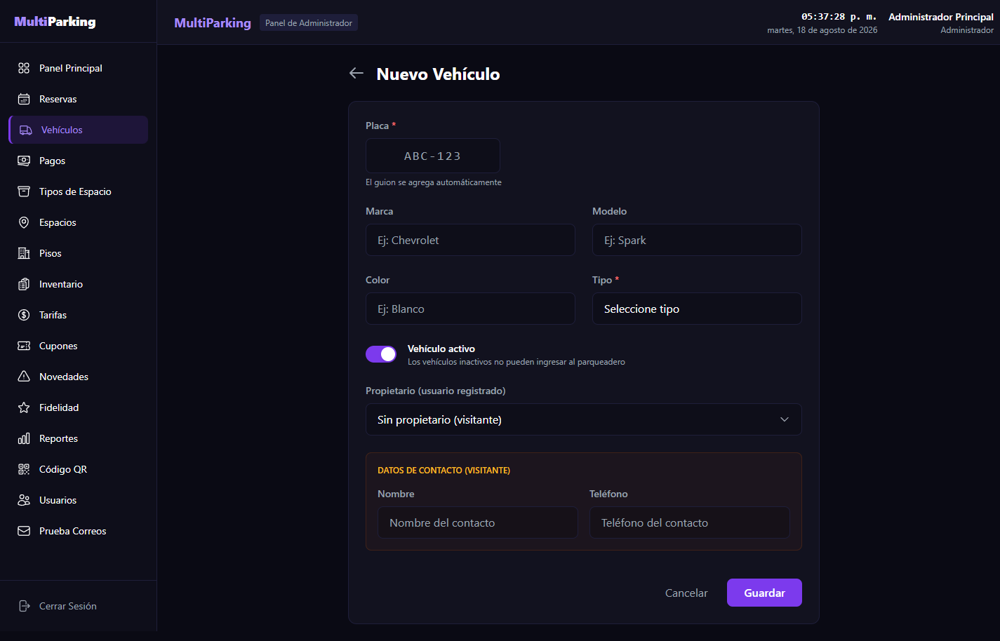

**Comportamiento verificado por inspección de la interfaz (no se creó un vehículo de prueba para no ensuciar el listado de vehículos reales del demo):** el bloque de contacto de visitante solo tiene sentido, y solo debería requerirse, cuando no se elige un propietario registrado — esto refleja directamente la regla `es_visitante = (fkIdUsuario is null)` del modelo `Vehiculo`.

#### Editar / Eliminar un vehículo

**Editar** abre el mismo formulario con los datos actuales. **Eliminar** pide confirmación; un vehículo con parqueos activos o reservas vigentes no debería poder eliminarse para no perder la trazabilidad.

### 4.7 Reservas

**Qué hace:** el administrador puede ver, crear, editar, finalizar y cancelar reservas de espacio de cualquier cliente.
**Cómo acceder:** menú lateral → **Reservas** (`/admin-panel/reservas/`) para ver el listado; la **creación** se hace desde el Panel Principal, no desde esta pantalla.

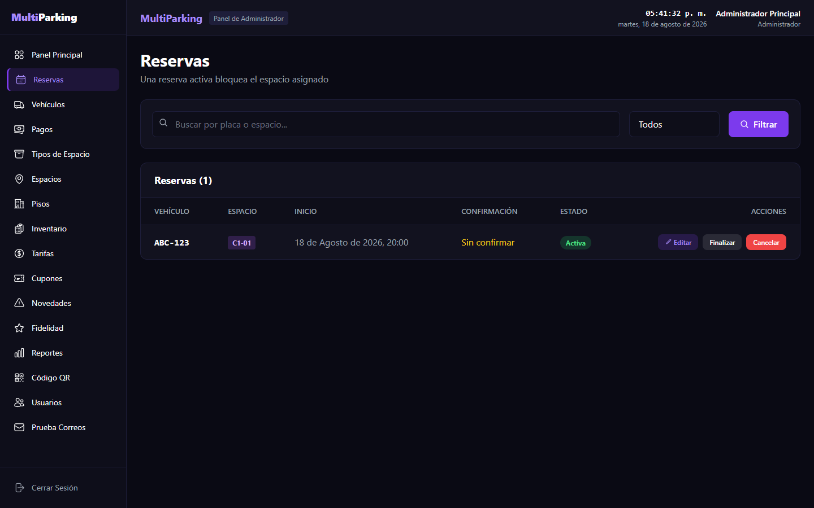

El listado tiene buscador por placa/espacio y filtro por Estado (Pendiente, Confirmada, Completada, Cancelada). Columnas: Vehículo, Espacio, Inicio, Confirmación ("Sin confirmar"/confirmada), Estado, Acciones.

**Nota importante sobre esta pantalla:** a diferencia de Pisos, Espacios, Tarifas, Cupones o Vehículos, esta vista **no tiene un botón "Nueva Reserva"**. Se intentó acceder directamente a `/admin-panel/reservas/crear/` y el servidor respondió **HTTP 405 (Method Not Allowed)** — no es un error del sistema: revisando el código (`reservas/views.py`, `AdminCrearReservaView`) esa vista solo acepta `POST` y su docstring indica *"Admin crea una reserva desde el mapa de espacios del dashboard"*. El punto de entrada real está en el Panel Principal.

#### Crear una reserva (desde el Panel Principal)

1. Ir a **Panel Principal**.
2. En la **Vista General de Pisos**, ubicar un espacio en estado **Disponible** (verde) y hacer clic en su ícono 📅.
3. Se abre un modal **"Crear Reserva"** con el espacio y piso ya identificados en el título.
4. Elegir **Cliente** — la lista solo incluye usuarios con rol CLIENTE.
5. Elegir **Vehículo** — este campo empieza deshabilitado con el texto "— Primero selecciona un cliente —"; al elegir el cliente, se recarga automáticamente (vía AJAX) con **solo los vehículos de ese cliente**.
6. **Fecha** viene precargada con la fecha actual.
7. Completar **Hora llegada** (obligatoria) y opcionalmente **Hora salida**.
8. Clic en **Crear Reserva**.

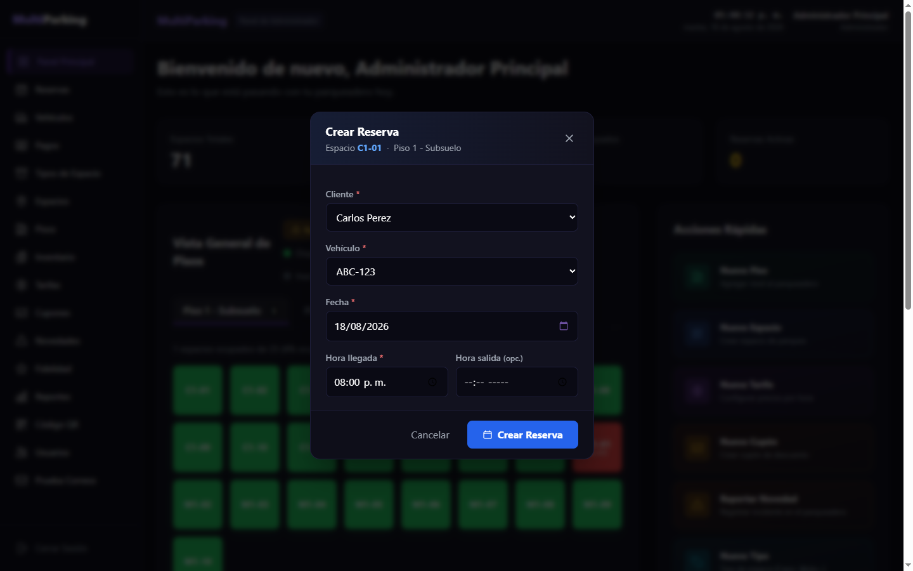

**Verificado en vivo, flujo completo:**
1. Se abrió el modal sobre el espacio **C1-01**.
2. Al elegir cliente **"Carlos Perez"**, el campo Vehículo recargó mostrando únicamente **sus 3 vehículos** (ABC-123, DEF-456, JKL-012) — confirmando que el filtrado por cliente funciona.
3. Se eligió **ABC-123**, hora **20:00**, y se envió el formulario.
4. El Panel Principal reflejó el cambio de inmediato: **Espacios Disponibles bajó de 70 a 69** y **Reservas Activas subió de 0 a 1**.
5. En el listado de Reservas apareció la fila: Vehículo `ABC-123`, Espacio `C1-01`, Inicio `18 de Agosto de 2026, 20:00`, Confirmación `Sin confirmar`, Estado `Activa`, con acciones **Editar**, **Finalizar**, **Cancelar**.
6. Se pulsó **Cancelar** — sin diálogo de confirmación adicional (a diferencia de los "Eliminar" de otras secciones, esta acción es inmediata) — y el banner mostró **"Reserva #1 cancelada."** La fila permaneció en el listado con Estado `Cancelada` y sin botones de acción, preservando el historial en vez de borrar el registro.

#### Editar, Finalizar y Cancelar una reserva

- **Editar** (`/admin-panel/reservas/<id>/editar/`): permite modificar fecha/hora de una reserva vigente.
- **Finalizar**: cierra la reserva como completada (uso típico cuando el cliente ya llegó y se convierte en un parqueo real).
- **Cancelar**: acción inmediata (sin diálogo nativo) que marca la reserva como `Cancelada` y libera el espacio a `Disponible`, sin eliminar el registro histórico.

### 4.8 Novedades

**Qué hace:** registra incidentes operativos (daños, observaciones) asociados a un vehículo y/o espacio, con foto y seguimiento de estado.
**Cómo acceder:** menú lateral → **Novedades**, o `/admin-panel/novedades/`. También accesible desde **Acciones Rápidas → Reportar Novedad** en el Panel Principal, y desde el botón **"Reportar Novedad"** sobre la Vista General de Pisos.

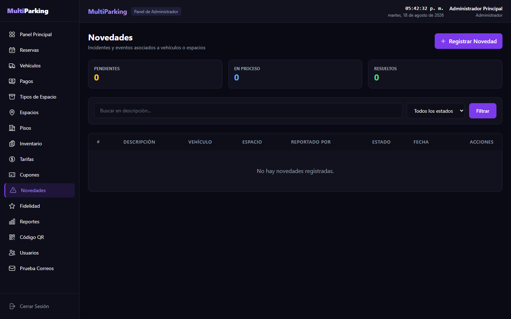

Tarjetas de resumen: Pendientes, En Proceso, Resueltos. Buscador por descripción y filtro por estado. Tabla: #, Descripción, Vehículo, Espacio, Reportado por, Estado, Fecha, Acciones (**Gestionar**, **Eliminar**).

#### Registrar una novedad

1. Clic en **Registrar Novedad** (`/admin-panel/novedades/crear/`).
2. Completar **Descripción** (obligatoria).
3. Opcionalmente relacionar un **Vehículo** y/o un **Espacio** (listas desplegables con todos los vehículos/espacios del sistema).
4. Opcionalmente **Asignar responsable** (solo aparecen usuarios ADMIN o VIGILANTE en la lista).
5. Opcionalmente adjuntar una **Foto**.
6. Clic en **Registrar Novedad**.

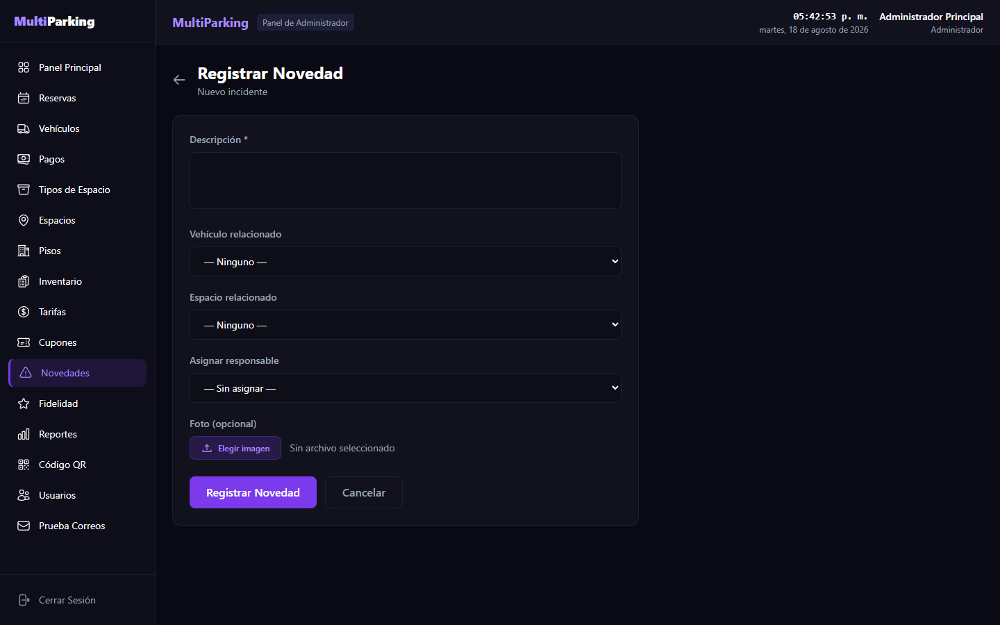

**Resultado esperado:** banner "Novedad registrada.", la novedad aparece en el listado con **Estado: Pendiente** y "Reportado por" se completa automáticamente con el usuario que la creó (no es un campo editable del formulario).

#### Gestionar (cambiar estado) una novedad

1. Clic en **Gestionar** sobre la fila de la novedad.
2. En la pantalla "Gestionar Novedad" se pueden editar los mismos campos del registro inicial, más:
   - **Estado**: Pendiente / En Proceso / Resuelto.
   - **Comentario / Acciones tomadas**: texto libre que documenta la resolución.
3. Clic en **Guardar cambios**.

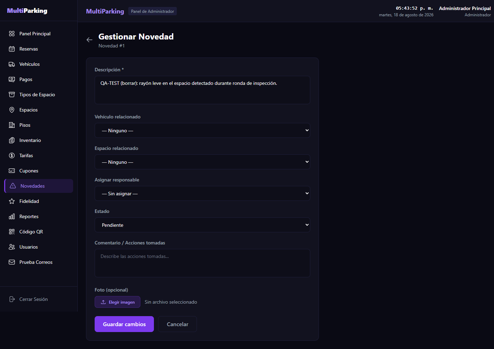

**Verificado en vivo, ciclo completo:**
1. Se creó la novedad "QA-TEST (borrar): rayón leve en el espacio detectado durante ronda de inspección." → apareció como **Pendiente** (contador Pendientes: 0→1).
2. Se abrió "Gestionar", se cambió Estado a **Resuelto** y se agregó el comentario "Se limpió la superficie, sin daño estructural. (prueba QA)".
3. Al guardar: banner **"Novedad #1 actualizada."**, contador Pendientes volvió a 0 y **Resueltos subió a 1**; el comentario apareció debajo de la descripción en la tabla.

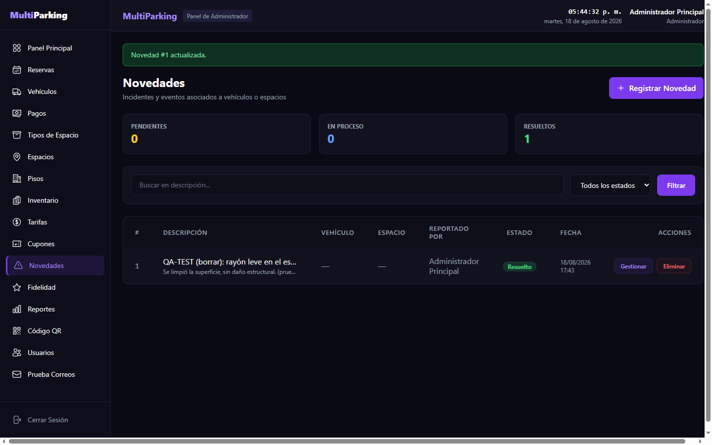

4. Se eliminó la novedad de prueba con **Eliminar**, que mostró el diálogo nativo *"¿Eliminar esta novedad?"*; al aceptar, quedó el listado vacío igual que al inicio.

### 4.9 Fidelidad

**Qué hace:** configura el programa de fidelización por stickers (cuántos stickers se necesitan para un bono, y cuántos días de vigencia tiene el cupón generado), y muestra el avance de cada cliente.
**Cómo acceder:** menú lateral → **Fidelidad**, o `/admin-panel/fidelidad/`.

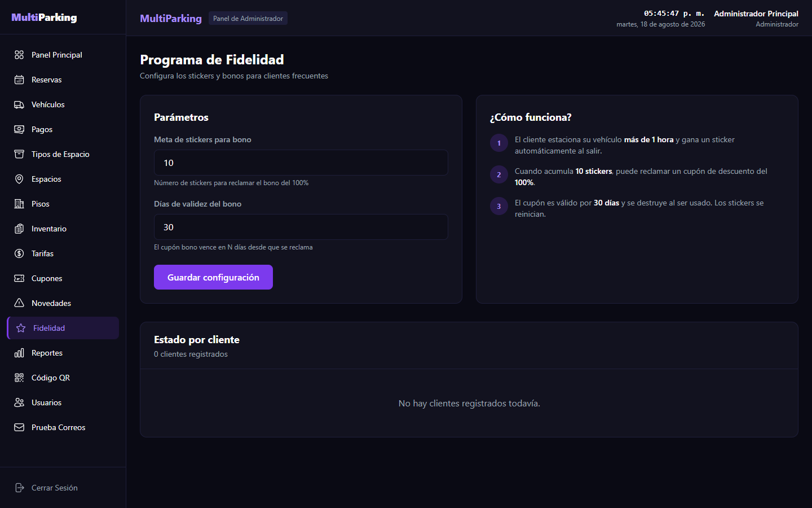

Esta es una configuración **global** (singleton `ConfiguracionFidelidad`, no hay una lista de "fidelidades"):

- **Meta de stickers para bono**: cuántos stickers debe acumular un cliente para poder reclamar el cupón de 100% (en el demo: 10).
- **Días de validez del bono**: cuántos días dura vigente el cupón una vez reclamado (en el demo: 30).

El panel derecho **"¿Cómo funciona?"** documenta la regla de negocio directamente en la interfaz:
1. El cliente estaciona su vehículo **más de 1 hora** y gana un sticker automáticamente al salir.
2. Al acumular la meta configurada (10 stickers en el demo), puede reclamar un cupón de descuento del 100%.
3. El cupón es válido por los días configurados (30) y se destruye al usarse; los stickers se reinician.

Debajo, la sección **"Estado por cliente"** lista cuántos stickers acumulados tiene cada cliente. En el momento de este relevamiento mostraba "0 clientes registrados" / "No hay clientes registrados todavía." — es decir, ningún cliente del demo tiene actualmente stickers acumulados (>0), aunque sí existen parqueos históricos; esto es coherente con la regla de que el sticker solo se otorga si la permanencia superó los 60 minutos **y** el vehículo tiene propietario registrado.

#### Cambiar la configuración

1. Editar **Meta de stickers para bono** y/o **Días de validez del bono**.
2. Clic en **Guardar configuración**.

**Nota:** no se modificó la configuración real del demo en vivo para no alterar el programa de fidelidad visible a otros usuarios; los campos y su efecto se documentaron a partir del texto explicativo de la propia interfaz y de `fidelidad/views.py` / `ConfiguracionFidelidad`.

### 4.10 Inventario

**Qué hace:** historial completo de entradas y salidas de vehículos (`InventarioParqueo`), con la posibilidad de registrar entradas/salidas manualmente desde el propio panel de administrador (misma capacidad operativa que tiene el Vigilante).
**Cómo acceder:** menú lateral → **Inventario**, o `/admin-panel/inventario/`.

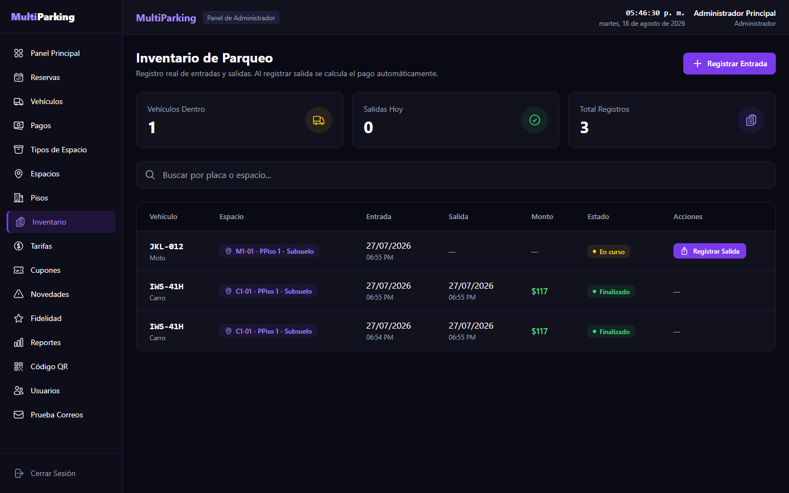

Tarjetas de resumen: Vehículos Dentro, Salidas Hoy, Total Registros. Buscador por placa o espacio. La tabla muestra Vehículo (con Tipo debajo), Espacio (con Piso), Entrada, Salida, Monto, Estado (**En curso** / **Finalizado**) y Acciones: **Registrar Salida** solo aparece en las filas "En curso"; las filas finalizadas no tienen acción disponible desde aquí.

El botón **Registrar Entrada** abre el mismo flujo que usa el Vigilante para dar ingreso a un vehículo (buscar/crear vehículo, elegir espacio disponible). Este manual documenta ese flujo paso a paso en la sección **4.2 (Registrar Ingreso)** del **Manual del Vigilante**, ya que es exactamente la misma pantalla y lógica — no se duplicó la prueba aquí para no generar un segundo parqueo de prueba en el histórico del demo.

**Regla de negocio observada en los datos reales del demo:** un vehículo (`JKL-012`) aparece con Estado **"En curso"** — coincide con el espacio M1-01 marcado como Ocupado en el Panel Principal. Los otros dos registros de `IWS-41H` están **Finalizados** con Monto `$117` cada uno — montos bajos porque corresponden a estadías de prueba de muy pocos minutos, consistentes con la fórmula de cobro por minuto redondeada a la baja tarifa mínima.

### 4.11 Pagos

**Qué hace:** historial de solo lectura de todos los pagos generados al registrar salidas de vehículos. No tiene botón de creación — el propio subtítulo lo aclara: *"Los pagos se generan automáticamente al registrar la salida del vehículo"*.
**Cómo acceder:** menú lateral → **Pagos**, o `/admin-panel/pagos/`.

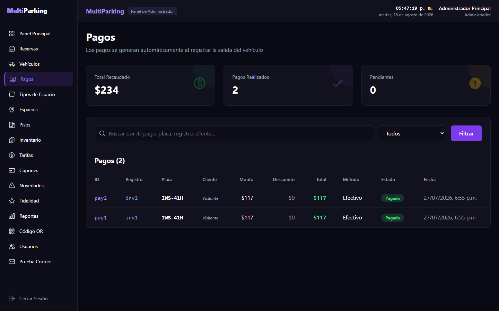

Tarjetas de resumen: Total Recaudado, Pagos Realizados, Pendientes. Buscador por ID de pago, placa, registro o cliente, y filtro por Estado (**Pendiente**, **Pagado**, **Anulado**). Columnas: ID, Registro (vincula al parqueo en Inventario), Placa, Cliente (o "Visitante" en cursiva si no tiene cuenta), Monto, Descuento, Total, Método, Estado, Fecha.

En el demo, ambos pagos existentes corresponden al mismo vehículo visitante `IWS-41H`, $117 cada uno, método Efectivo, Estado Pagado — coherentes con los dos registros "Finalizado" vistos en Inventario.

**No se generó un pago de prueba en esta sección**, ya que un pago solo se crea como consecuencia de un ciclo completo de ingreso→salida (documentado en el Manual del Vigilante, sección 4.2), y ese ciclo sí se ejecutó y verificó allí como parte de este trabajo.

### 4.12 Reportes

**Qué hace:** genera reportes agregados de ingresos, ocupación, reservas y uso, exportables a PDF y Excel.
**Cómo acceder:** menú lateral → **Reportes**, o `/admin-panel/reportes/`.

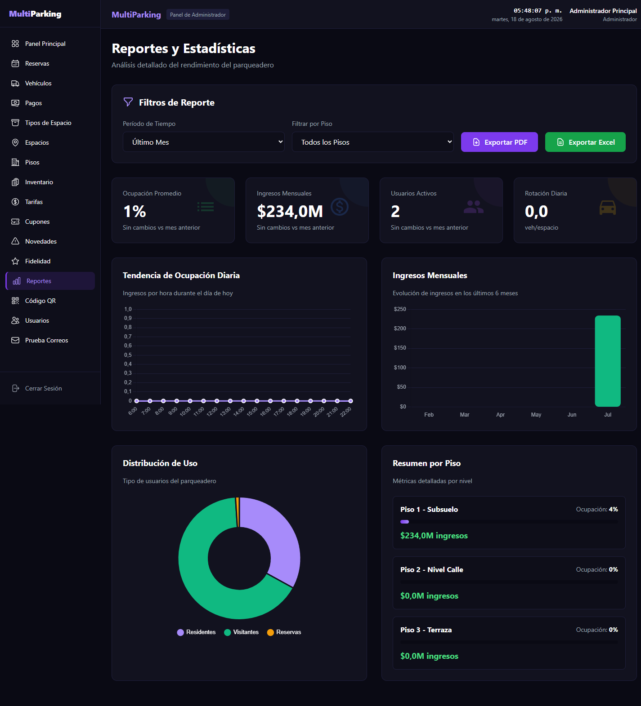

**Filtros de Reporte**: Período de Tiempo (ej. "Último Mes") y Filtrar por Piso ("Todos los Pisos" o uno específico).

**Tarjetas**: Ocupación Promedio, Ingresos Mensuales, Usuarios Activos, Rotación Diaria.

**Gráficas**: Tendencia de Ocupación Diaria (ingresos por hora del día), Ingresos Mensuales (evolución últimos 6 meses), Distribución de Uso (dona: Residentes / Visitantes / Reservas), y Resumen por Piso (ocupación e ingresos individuales de cada piso).

#### Exportar reportes

Los botones **Exportar PDF** y **Exportar Excel** descargan el reporte con los filtros actualmente aplicados.

**Verificado en vivo (sin necesidad de descargar el archivo, comprobando la respuesta HTTP):**
- `/admin-panel/reportes/exportar-pdf/` → `200 OK`, `Content-Type: application/pdf`, ~2.9 KB.
- `/admin-panel/reportes/exportar-excel/` → `200 OK`, `Content-Type: application/vnd.openxmlformats-officedocument.spreadsheetml.sheet`, ~5.1 KB.

Ambas exportaciones responden correctamente y con el tipo de archivo esperado.

#### Hallazgo — error de formato en la tarjeta "Ingresos Mensuales"

La tarjeta superior **"Ingresos Mensuales"** mostraba **"$234,0M"** (es decir, $234 millones) en el momento de esta verificación, mientras que el **Total Recaudado real**, confirmado independientemente en la sección Pagos, es de **$234 COP** (dos pagos de $117 cada uno). El sufijo "M" (millones) está mal aplicado sobre un valor que no está en millones — es un **error de formato de unidades en el frontend de Reportes**, no un problema de los datos en sí (el gráfico de barras de "Ingresos Mensuales" de los últimos 6 meses sí ubica la barra de julio en la posición correcta de la escala $0–$250, consistente con $234 sin multiplicar). Se documenta como hallazgo para corrección; no se intentó arreglar el código en este pase por estar fuera del alcance de "generar el manual".

### 4.13 Usuarios

**Qué hace:** administra todas las cuentas del sistema (ADMIN, VIGILANTE, CLIENTE): crear, editar, activar/desactivar y eliminar.
**Cómo acceder:** menú lateral → **Usuarios**, o `/admin-panel/usuarios/`.

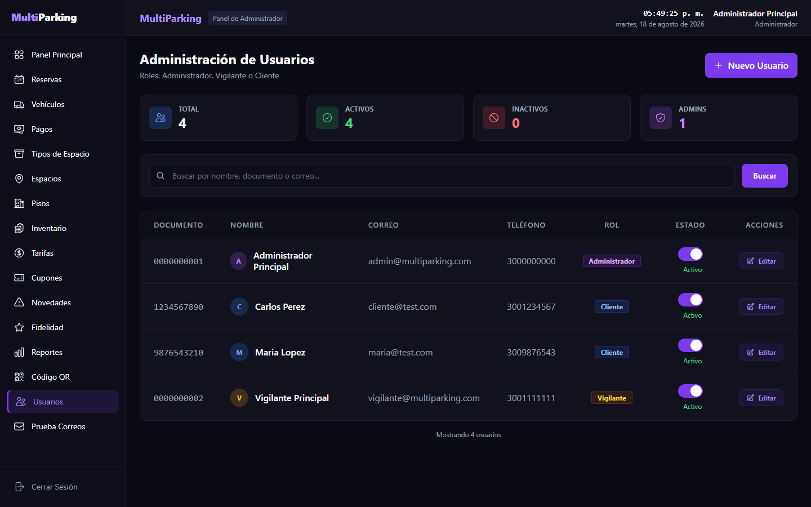

Tarjetas de resumen: Total, Activos, Inactivos, Admins. Buscador por nombre, documento o correo. Tabla: Documento, Nombre, Correo, Teléfono, Rol (con color por rol), **Estado** (interruptor Activo/Inactivo que se puede alternar directamente desde la lista) y **Editar**.

#### Eliminación protegida por teclado (hallazgo verificado en el código)

A diferencia de todas las demás secciones del panel, la lista de Usuarios **no muestra ningún botón "Eliminar" visible**. Se confirmó revisando el HTML/JS de la plantilla (`templates/admin_panel/usuarios/list.html`) que el botón de eliminar de cada fila existe en el DOM pero permanece oculto (clase CSS `hidden`) hasta que el administrador **escribe literalmente la palabra "eliminar" con el teclado** en cualquier parte de la página (sin tener el foco en un campo de texto). Al completarse esa secuencia de 8 teclas en menos de 1.5 segundos, JavaScript quita la clase `hidden` de todos los botones de eliminar; presionar **Escape** los vuelve a ocultar. Es una medida deliberada anti-clic-accidental para la acción más sensible del panel (borrar una cuenta de usuario).

> Nota de verificación: se comprobó la lógica exacta leyendo el código fuente de la plantilla. No se completó la demostración interactiva en el navegador porque el propio entorno de automatización bloqueó como medida de seguridad la tecla final de la secuencia "eliminar" — un guardrail razonable dado que esa secuencia de teclas está diseñada para desbloquear una acción destructiva.

#### Crear un usuario

1. Clic en **Nuevo Usuario** (`/admin-panel/usuarios/crear/`).
2. Completar los campos obligatorios: **Número de Documento**, **Nombre**, **Apellido**, **Correo Electrónico**, **Rol**, **Contraseña** (mínimo 6 caracteres; el formulario aclara: *"La contraseña se almacena cifrada con hash seguro"*).
3. **Teléfono** es opcional.
4. **Rol** ofrece Administrador, Vigilante o Cliente.
5. El interruptor **Usuario Activo** viene encendido.
6. Clic en **Guardar Usuario**.

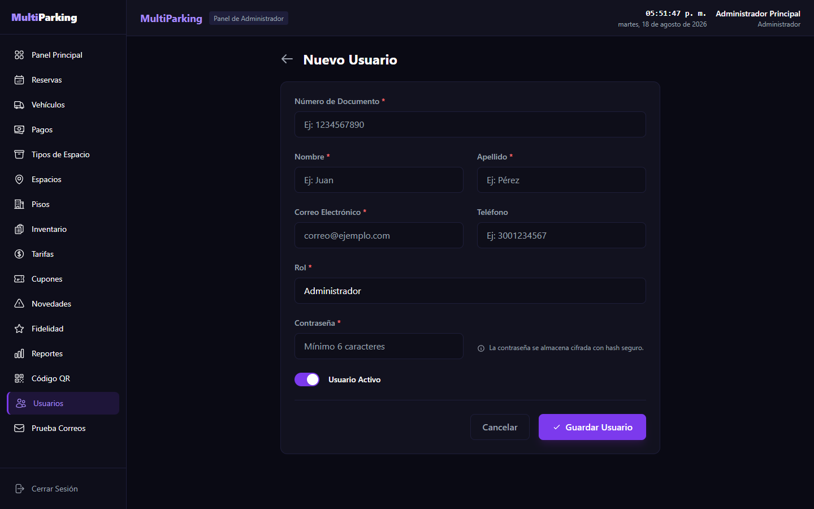

**No se creó una cuenta de prueba en el demo en vivo** para no ensuciar la base de usuarios reales visible a otros visitantes del sistema; el formulario se documentó por inspección directa de sus campos y textos de ayuda.

#### Editar, activar/desactivar

**Editar** abre el mismo formulario con los datos actuales (la contraseña se deja en blanco si no se desea cambiar). El interruptor de **Estado** en la propia lista permite activar/desactivar una cuenta con un clic, sin pasar por el formulario de edición — un usuario desactivado no puede iniciar sesión.

### 4.14 Código QR

**Qué hace:** genera un código QR universal para pegar físicamente en la entrada del parqueadero, de forma que los clientes lo escaneen con su teléfono para registrar su propio ingreso.
**Cómo acceder:** menú lateral → **Código QR**, o `/admin-panel/qr/generar/`.

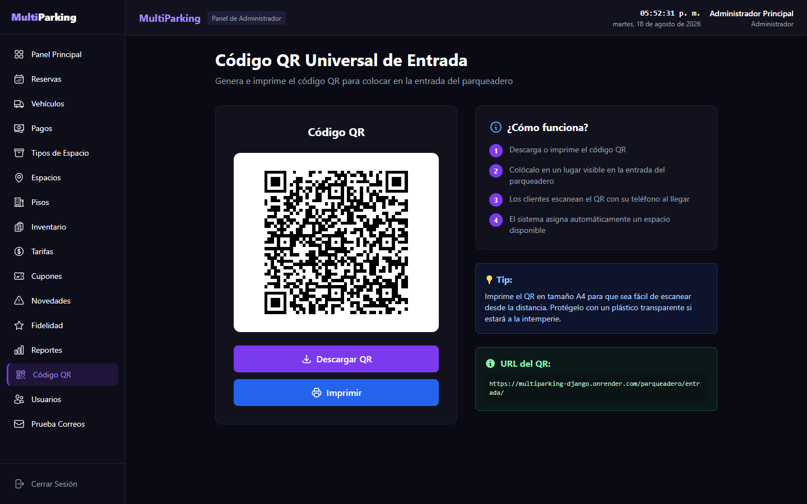

El panel derecho explica el flujo completo:
1. Descarga o imprime el código QR.
2. Colócalo en un lugar visible en la entrada del parqueadero.
3. Los clientes escanean el QR con su teléfono al llegar.
4. El sistema asigna automáticamente un espacio disponible.

Un recuadro de **Tip** recomienda imprimirlo en tamaño A4 y protegerlo con plástico transparente si va a estar a la intemperie.

**Verificado por inspección:** la **URL del QR** se muestra en texto plano en la propia pantalla: `https://multiparking-django.onrender.com/parqueadero/entrada/` — es decir, el QR apunta directamente a la vista de registro de entrada (`EntradaParqueaderoView`), no a la vista intermedia de escaneo (`/parqueadero/escanear/`).

Los botones **Descargar QR** e **Imprimir** permiten obtener la imagen del código o enviarla directamente a impresión desde el navegador.

### 4.15 Prueba de Correos

**Qué hace:** permite verificar, sin salir del panel, que el proveedor de correo configurado (Resend o SendGrid) esté funcionando.
**Cómo acceder:** menú lateral → **Prueba Correos**, o `/admin-panel/test-email/`.

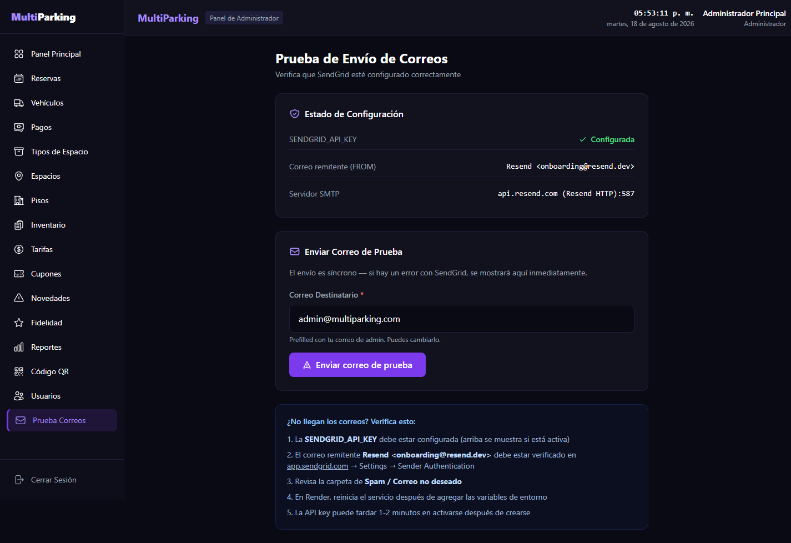

La sección **Estado de Configuración** muestra en tiempo real:
- **SENDGRID_API_KEY**: si está configurada.
- **Correo remitente (FROM)**: en el demo, `Resend <onboarding@resend.dev>`.
- **Servidor SMTP**: en el demo, `api.resend.com (Resend HTTP):587`.

Esto confirma en vivo la lógica descrita en `multiparking/settings.py`: aunque `SENDGRID_API_KEY` está configurada, el proveedor **Resend tiene prioridad** y es el que realmente se usa para enviar.

#### Enviar un correo de prueba

1. Confirmar/editar el **Correo Destinatario** (viene precargado con el correo del administrador).
2. Clic en **Enviar correo de prueba**. El envío es síncrono: cualquier error del proveedor se muestra de inmediato en la misma pantalla.

**Verificado en vivo — resultado real, con un hallazgo:**

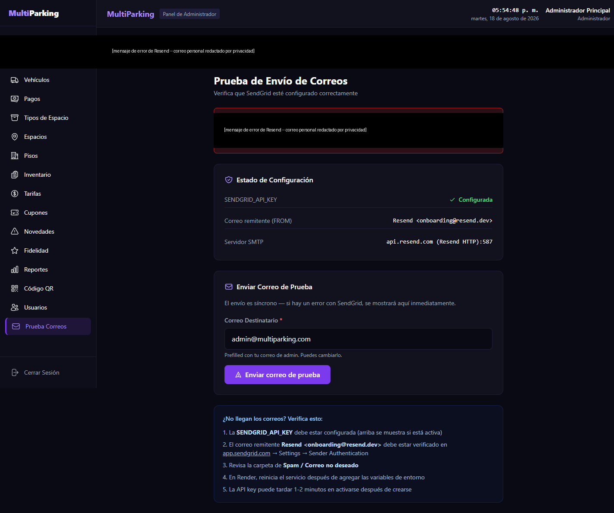

El envío **falló** con un error `403 Forbidden` de la API de Resend, cuyo mensaje explica la causa real: la cuenta de Resend usada en este demo está en modo de pruebas (*sandbox*) y **solo puede enviar correos a la dirección personal verificada del propietario de la cuenta**, no a `admin@multiparking.com` ni a cualquier otro destinatario, hasta que se verifique un dominio propio en resend.com/domains y se cambie el remitente a una dirección de ese dominio.

**Hallazgo de privacidad (reportado, no explotado):** el mensaje de error de Resend, devuelto tal cual por la API, **incluye la dirección de correo personal (Gmail) del propietario de la cuenta de Resend**. Como las credenciales de administrador de este demo son públicas (publicadas en el propio `README.md` del proyecto para fines de prueba), *cualquier persona* que inicie sesión como administrador y presione "Enviar correo de prueba" puede ver esa dirección de correo personal expuesta en pantalla. Las capturas de este manual la ocultan deliberadamente. Se recomienda: (a) verificar un dominio propio en Resend para que el remitente no dependa del modo sandbox, y/o (b) que la vista de prueba de correo capture esta excepción puntual y muestre un mensaje genérico en vez de reenviar el cuerpo crudo de la respuesta de la API al navegador.

#### Checklist de diagnóstico (texto de ayuda de la propia pantalla)

1. La `SENDGRID_API_KEY` debe estar configurada.
2. El correo remitente debe estar verificado en `app.sendgrid.com` → Settings → Sender Authentication — **inconsistencia menor observada**: este paso de ayuda menciona específicamente SendGrid y su panel `app.sendgrid.com`, pero el proveedor activo mostrado arriba es Resend; el texto de ayuda no se actualizó cuando se priorizó Resend sobre SendGrid en el código.
3. Revisar la carpeta de Spam.
4. En Render, reiniciar el servicio tras agregar variables de entorno.
5. La API key puede tardar 1-2 minutos en activarse tras crearse.

---

## 5. Flujos completos

### 5.1 Configurar el parqueadero desde cero (onboarding de un piso nuevo)

1. **Crear el piso**: Pisos → Nuevo Piso → nombrar (ej. "Piso 4 - Sótano 2") → Guardar.
2. **Verificar/crear el tipo de espacio** necesario en Tipos de Espacio (Carro/Moto ya existen en el demo).
3. **Poblar los espacios**: Espacios → Crear Rango → prefijo, número inicio/fin, elegir el piso nuevo y el tipo → Generar Espacios.
4. **Definir la tarifa** para ese tipo de espacio (si no existe ya una activa): Tarifas → Nueva Tarifa → completar precios → activar.
5. Verificar en el **Panel Principal** que el nuevo piso aparece como pestaña en la Vista General de Pisos, con todos sus espacios en verde (Disponible).

### 5.2 Ciclo de vida completo de una reserva (verificado en vivo en este manual)

1. Panel Principal → clic en 📅 sobre un espacio Disponible.
2. Elegir Cliente → el campo Vehículo se recarga con los vehículos de ese cliente.
3. Elegir Vehículo, Fecha y Hora llegada → Crear Reserva.
4. El espacio pasa de Disponible a reservado y el contador "Reservas Activas" del dashboard sube.
5. En Reservas, la reserva aparece "Activa" / "Sin confirmar".
6. **Finalizar** (el cliente llegó y se convierte en un parqueo real) o **Cancelar** (el cliente no llegó; libera el espacio, conserva el registro con Estado "Cancelada").

### 5.3 Ciclo de vida completo de una novedad (verificado en vivo en este manual)

1. Registrar Novedad → describir el incidente, opcionalmente vincular vehículo/espacio/responsable y adjuntar foto → queda en Estado **Pendiente**.
2. Gestionar → cambiar a **En Proceso** mientras se atiende.
3. Gestionar → cambiar a **Resuelto** y documentar en "Comentario / Acciones tomadas" qué se hizo.
4. Opcionalmente, Eliminar si la novedad ya no debe conservarse (esta acción sí pide confirmación nativa del navegador).

---

## 6. Errores y problemas frecuentes

| Problema | Causa observada | Qué hacer |
|---|---|---|
| No aparece botón para crear una reserva en `/admin-panel/reservas/` | Diseño intencional: la creación se hace desde el mapa de espacios del Panel Principal, no desde el listado | Ir a Panel Principal → ícono 📅 sobre un espacio Disponible |
| `/admin-panel/reservas/crear/` responde 405 al abrirlo directamente en el navegador | La vista solo acepta `POST` (uso interno vía AJAX) | No es un error; usar el flujo del punto anterior |
| El botón "Eliminar" no aparece en Usuarios | Medida de seguridad: estos botones están ocultos hasta escribir la palabra "eliminar" con el teclado en la página | Escribir "eliminar" (sin foco en un campo de texto); Escape para volver a ocultarlos |
| "Ingresos Mensuales" en Reportes muestra un valor con "M" (millones) que parece demasiado alto | Bug de formato de unidades en el frontend de Reportes (ver 4.12) | Verificar el monto real en la sección Pagos |
| Al enviar un correo de prueba aparece un error 403 de Resend | La cuenta de Resend está en modo sandbox y solo puede enviar al correo verificado del propietario | Verificar un dominio en resend.com/domains y actualizar el remitente, o usar el destinatario permitido en modo sandbox |
| Un tipo de espacio, tarifa o cupón con datos asociados no se puede eliminar | Regla de integridad: no se puede romper la relación con espacios/pagos/parqueos existentes | Editar/desactivar en vez de eliminar, o eliminar primero los registros dependientes |

## 7. Buenas prácticas

- Antes de eliminar un piso, tipo de espacio o tarifa, revisar cuántos espacios/tarifas/pagos tiene asociados — el sistema bloquea la eliminación en varios de estos casos, pero es mejor anticiparlo.
- Usar **Desactivar** en vez de **Eliminar** siempre que se quiera conservar el historial (tarifas, cupones).
- Al crear una reserva desde el mapa de espacios, verificar primero que el cliente tenga al menos un vehículo registrado — si no, el campo Vehículo quedará vacío tras elegir el cliente.
- Revisar periódicamente **Reportes** y **Novedades** para detectar anomalías operativas.
- Usar la **Prueba de Correos** después de cualquier cambio en las variables de entorno de email en producción.

## 8. Preguntas frecuentes

**¿Por qué no veo un botón para eliminar un usuario?**
Está oculto a propósito. Escribe la palabra "eliminar" en el teclado (sin tener el cursor en un campo de texto) para revelar los botones de eliminar en esa pantalla.

**¿Por qué no puedo eliminar un tipo de espacio o una tarifa?**
Porque tiene espacios, tarifas o pagos asociados. El sistema lo bloquea para no romper la integridad de los datos históricos.

**¿Dónde se crea una reserva como administrador?**
Desde el Panel Principal, haciendo clic en el ícono de calendario (📅) sobre un espacio disponible — no desde la pantalla de listado de Reservas.

**¿Qué diferencia hay entre Cancelar una reserva y Eliminar un registro?**
Cancelar cambia el estado a "Cancelada" pero conserva el registro para el historial. La mayoría de las demás entidades (pisos, tipos, tarifas, cupones, vehículos, novedades) sí tienen una eliminación real, generalmente protegida por un diálogo de confirmación.

## 9. Glosario

| Término | Significado |
|---|---|
| Espacio | Unidad física de parqueo (ej. "C1-01"), asociada a un Piso y un Tipo de Espacio |
| Piso | Nivel del parqueadero que agrupa espacios; no tiene tarifa propia |
| Tipo de Espacio | Categoría de vehículo (Carro, Moto…) usada para tarifas y filtros |
| Tarifa | Precio por hora/día/mes para un tipo de espacio, con vigencia por fechas |
| Cupón | Código de descuento (porcentaje o valor fijo) con vigencia y estado activo/inactivo |
| Inventario | Historial de entradas y salidas de vehículos (`InventarioParqueo`) |
| Novedad | Incidente operativo reportado, con estados Pendiente / En Proceso / Resuelto |
| Sticker | Unidad de fidelización otorgada a un cliente registrado tras un parqueo de más de 1 hora |
| Visitante | Vehículo sin usuario propietario asociado (`fkIdUsuario` nulo) |
| Reserva "Sin confirmar" | Reserva creada pero que aún no ha sido confirmada como completada por el flujo operativo |

