# Manual de Usuario — Rol Cliente

**Sistema:** MultiParking — Gestión Integral de Parqueaderos Privados
**Versión del manual:** 1.0
**Fecha:** 18 de agosto de 2026
**Rol documentado:** Cliente (`rolTipoRol = CLIENTE`)
**Experiencia documentada:** **Móvil** (viewport 390×844, iPhone 12/13) — este es el rol de usuario final, y su experiencia real y principal es desde el teléfono.

---

## Índice

1. [Introducción](#1-introducción)
2. [Acceso al sistema](#2-acceso-al-sistema)
3. [Interfaz principal (móvil)](#3-interfaz-principal-móvil)
4. [Funcionalidades](#4-funcionalidades)
   - [4.1 Ver el estado actual de mi parqueo](#41-ver-el-estado-actual-de-mi-parqueo)
   - [4.2 Gestionar mis vehículos](#42-gestionar-mis-vehículos)
   - [4.3 Reservar un espacio](#43-reservar-un-espacio)
   - [4.4 Ingresar escaneando el código QR](#44-ingresar-escaneando-el-código-qr)
   - [4.5 Salir y pagar](#45-salir-y-pagar)
   - [4.6 Perfil, fidelidad y cuponera](#46-perfil-fidelidad-y-cuponera)
   - [4.7 Historial de pagos y recibo](#47-historial-de-pagos-y-recibo)
5. [Flujos completos](#5-flujos-completos)
6. [Errores y problemas frecuentes](#6-errores-y-problemas-frecuentes)
7. [Buenas prácticas](#7-buenas-prácticas)
8. [Preguntas frecuentes](#8-preguntas-frecuentes)
9. [Glosario](#9-glosario)

---

## 1. Introducción

El rol **Cliente** es el usuario final registrado del parqueadero: alguien que tiene una cuenta, uno o más vehículos propios, y utiliza la aplicación principalmente desde su teléfono para reservar espacio, ver cuánto lleva acumulado mientras su vehículo está estacionado, pagar, y aprovechar el programa de fidelidad por stickers. A diferencia del Administrador y el Vigilante, el Cliente solo ve y gestiona **su propia información** (sus vehículos, sus reservas, su historial de pagos, sus stickers).

## 2. Acceso al sistema

Igual que los demás roles: `https://multiparking-django.onrender.com/login/`.

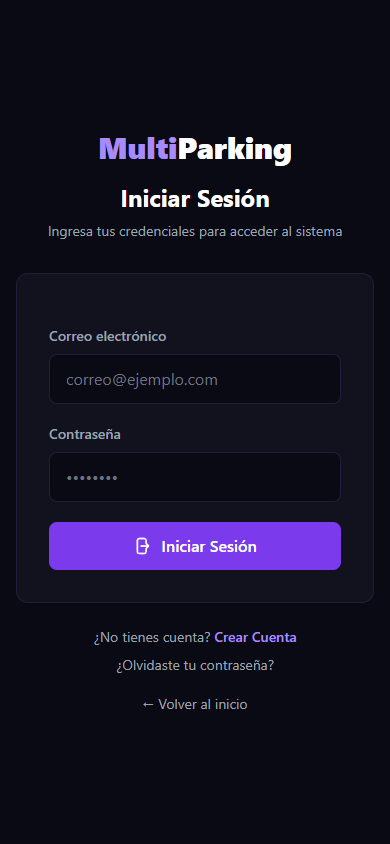

Credenciales de cliente de prueba: `cliente@test.com` / `test123` (Carlos Pérez). También existe `maria@test.com` / `test123` (María López). Un cliente nuevo puede registrarse desde **Crear Cuenta**. Al autenticar, el sistema redirige a `/dashboard/`.

## 3. Interfaz principal (móvil)

En móvil, todo el panel del cliente se organiza en una sola columna, con tarjetas apiladas verticalmente — nada de tablas anchas ni menús laterales fijos.

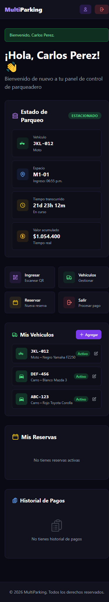

De arriba a abajo:

- **Barra superior**: logo, ícono de perfil, botón de cerrar sesión.
- **Banner de bienvenida** y saludo personalizado ("¡Hola, Carlos Pérez! 👋").
- **Estado de Parqueo**: si el cliente tiene un vehículo actualmente estacionado, muestra una insignia **"ESTACIONADO"** y el detalle: Vehículo, Espacio (con hora de ingreso), **Tiempo transcurrido** y **Valor acumulado** — estos dos últimos se calculan **en tiempo real** mientras el vehículo permanece adentro.
- **Accesos rápidos** (grilla 2×2): **Ingresar** (Escanear QR), **Vehículos** (Gestionar), **Reservar** (Nueva reserva), **Salir** (Procesar pago).
- **Mis Vehículos**: tarjetas por cada vehículo propio (placa, tipo, marca/color, estado Activo, ícono de editar) y botón **+ Agregar**.
- **Mis Reservas**: reservas activas del cliente (o "No tienes reservas activas").
- **Historial de Pagos**: pagos anteriores del cliente (o "No tienes historial de pagos").
- **Pie de página** con derechos reservados.

**Dato real observado:** en el demo, Carlos Pérez tiene su moto `JKL-012` estacionada en `M1-01` desde hace **21 días, 23 horas y 12 minutos** (dato de la semilla de datos, no generado en esta sesión), acumulando **$1.054.400 COP** en tiempo real — sirve como buen ejemplo visual de que el contador de valor acumulado sí funciona de forma continua mientras no se registra la salida.

---

## 4. Funcionalidades

### 4.1 Ver el estado actual de mi parqueo

La tarjeta **Estado de Parqueo** solo aparece cuando el cliente tiene un vehículo actualmente dentro del parqueadero (con propietario registrado). Muestra Vehículo, Espacio (con hora de ingreso), **Tiempo transcurrido** y **Valor acumulado**, ambos actualizados en tiempo real sin necesidad de recargar la página. Si no hay ningún vehículo adentro, esta tarjeta simplemente no se muestra.

### 4.2 Gestionar mis vehículos

**Ver mis vehículos:** sección "Mis Vehículos" en el dashboard — cada tarjeta muestra placa, tipo, marca/modelo/color, estado (Activo/Inactivo) y un ícono de editar.

**Agregar un vehículo:**
1. Botón **+ Agregar** (o acceso rápido **Vehículos → Gestionar**, que desplaza a la misma sección) → `/cliente/vehiculos/crear/`.
2. Completar **Placa** (el guion se agrega automáticamente).
3. Elegir **Tipo de Vehículo**: Carro o Moto (tarjetas visuales, "Carro" viene preseleccionado).
4. **Marca**, **Modelo** y **Color** son opcionales, cada uno con su propia validación de formato (letras/números/puntos según el campo).
5. El interruptor **Vehículo activo** viene encendido; el texto de ayuda aclara: *"Si está inactivo, no podrás usarlo para reservas ni ingresos"*.
6. Tocar **Agregar Vehículo**.

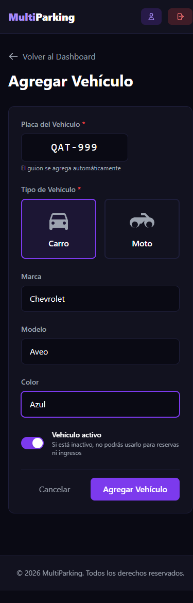

**Resultado esperado:** banner *"Vehículo [placa] agregado exitosamente."* y el vehículo aparece de inmediato en "Mis Vehículos".

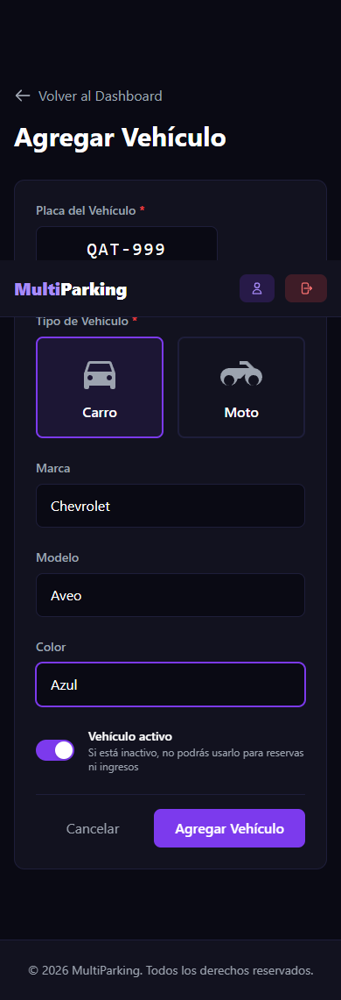

**Editar un vehículo:** ícono de lápiz junto al vehículo → mismo formulario, con el botón ahora llamado **Actualizar Vehículo**.

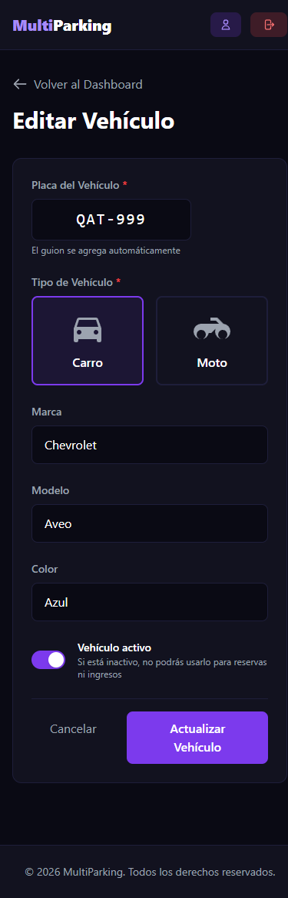

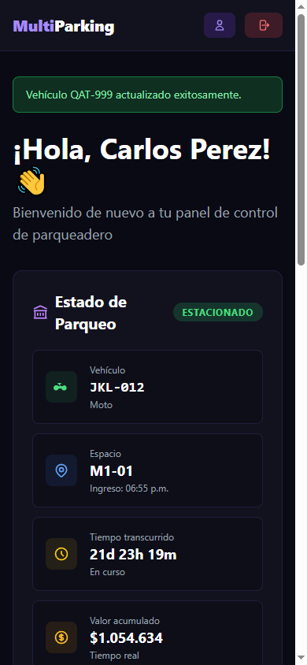

**No existe una opción para eliminar un vehículo desde el panel de cliente** — solo Crear y Editar (incluyendo desactivarlo con el interruptor "Vehículo activo"). Si un cliente necesita eliminar un vehículo por completo, debe solicitarlo a un Administrador.

### 4.3 Reservar un espacio

1. Acceso rápido **Reservar** → `/cliente/reservas/crear/`.
2. Elegir **Vehículo** (obligatorio) — al elegirlo, aparece la lista de espacios disponibles filtrada por el tipo de ese vehículo.
3. **Fecha de Inicio** viene precargada con el día actual.
4. **Hora de Llegada** (obligatoria).
5. **Seleccionar Espacio**: pestañas por piso, tarjetas por espacio disponible.
6. Leer el recuadro **"Información importante"**: las reservas deben hacerse con al menos 1 hora de anticipación, tienen un costo de **$8.000 COP**, se pueden cancelar hasta 1 hora antes, y si no se llega en los primeros 15 minutos la reserva puede cancelarse automáticamente.
7. Tocar **Confirmar Reserva**.

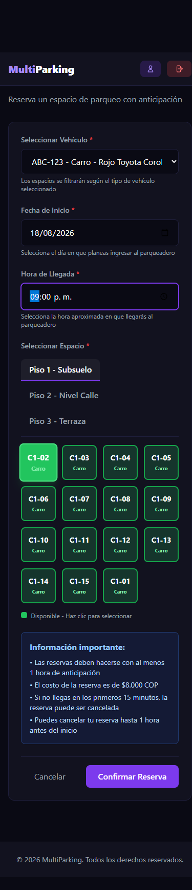

**Verificado en vivo:** se reservó el espacio **C1-02** con el vehículo `ABC-123` para las 21:00 del mismo día. Resultado: banner *"Reserva creada exitosamente para ABC-123 el 2026-08-18 a las 21:00."* y la reserva apareció en "Mis Reservas" con estado **Pendiente**.

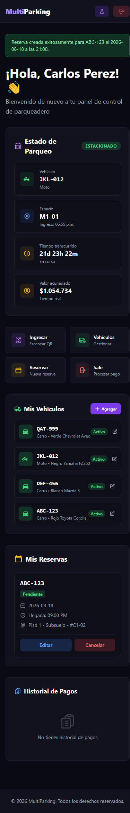

**Cancelar una reserva:** botón **Cancelar** en la tarjeta de la reserva (pide confirmación mediante un diálogo `confirm()` del navegador: *"¿Estás seguro de cancelar esta reserva?"*). **Verificado en vivo:** al cancelar, banner *"Reserva cancelada exitosamente."* y la reserva desaparece de "Mis Reservas" (no queda visible en el dashboard del cliente, a diferencia de la vista de Administrador donde sí se conserva con estado "Cancelada").

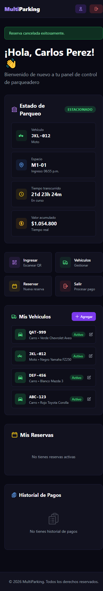

**Editar una reserva:** botón **Editar** en la misma tarjeta, mismo formulario con los datos precargados (no verificado de punta a punta en esta sesión).

### 4.4 Ingresar escaneando el código QR

Acceso rápido **Ingresar → Escanear QR** (`/parqueadero/escanear/`). Esta pantalla solicita permiso de cámara al navegador y, al detectar el código QR pegado en la entrada física del parqueadero (el mismo que genera el Administrador — ver Manual del Administrador, sección 4.14), redirige automáticamente al registro de entrada.

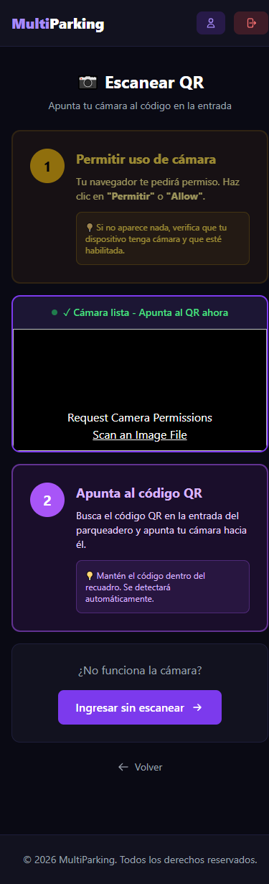

Si la cámara no está disponible, un enlace **"Ingresar sin escanear"** lleva directamente a `/parqueadero/entrada/` sin necesidad de cámara — así se verificó este flujo en esta sesión (el entorno de pruebas no tiene cámara física).

**Formulario "Entrada Sin Reserva":**
1. Elegir el vehículo que ingresa (tarjetas de selección, uno por cada vehículo propio).
2. El sistema aclara: *"Se te asignará automáticamente un espacio disponible según el tipo de tu vehículo (CARRO o MOTO)"* — el cliente no elige el espacio.
3. Tocar **Ingresar al Parqueadero**.

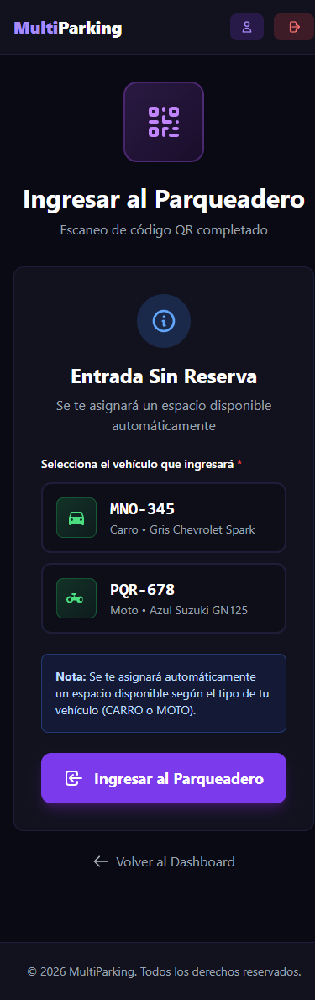

**Verificado en vivo:** con la cuenta de María López y su vehículo `MNO-345`, el ingreso se registró correctamente, asignando el espacio **C1-01**. Pantalla de confirmación: *"¡Bienvenido! Tu ingreso ha sido registrado"*, con Vehículo, Espacio asignado, Piso y Hora de ingreso, más un recordatorio: *"Antes de salir, procesa tu pago desde el Dashboard"* y *"Puedes pagar con PSE (salida inmediata) o Efectivo (en caja)"*.

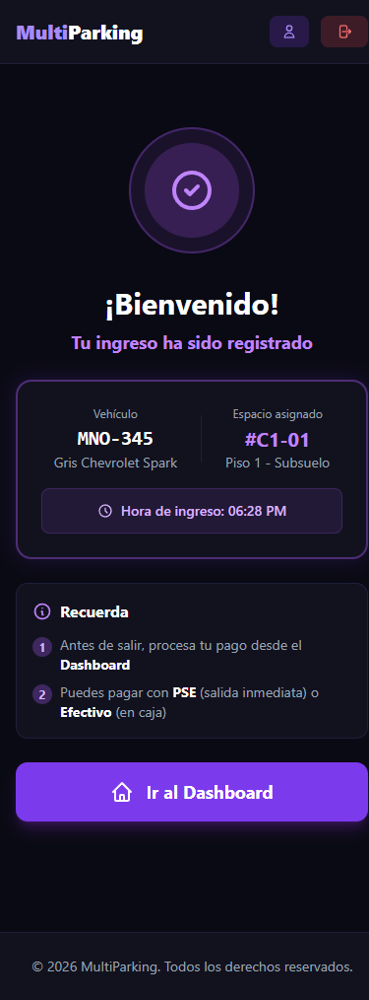

**Regla de negocio verificada:** un cliente que ya tiene un vehículo dentro del parqueadero no puede registrar otro ingreso — al intentarlo con Carlos Pérez (que ya tenía `JKL-012` adentro), el sistema redirigió al dashboard con el mensaje *"Ya tienes el vehículo JKL-012 dentro del parqueadero en el espacio M1-01."*, sin permitir un segundo ingreso simultáneo.

### 4.5 Salir y pagar

Acceso rápido **Salir → Procesar pago** (`/parqueadero/salida/`). Si no hay ningún vehículo propio dentro del parqueadero, el sistema redirige al dashboard con el mensaje *"No tienes ningún vehículo dentro del parqueadero."*

Si sí hay un vehículo adentro, se muestra la pantalla **"Procesar Salida"**:

- **Información de Estadía**: Vehículo, Espacio, Entrada, Tiempo transcurrido.
- **Resumen de Pago**: Tarifa por hora, Minutos totales, **Total a pagar**.
- **¿Tienes un cupón de descuento?**: campo de texto + botón **Aplicar**.
- **Método de Pago**: **PSE (Pasarela de Prueba)** — "Pago inmediato en línea" (preseleccionado) — o **Efectivo en Caja** — "Pagar en el punto de atención".
- Aviso: *"Tienes 10 minutos para salir del parqueadero después de procesar el pago para evitar sanciones."*
- Botón **Procesar Pago y Salir**.

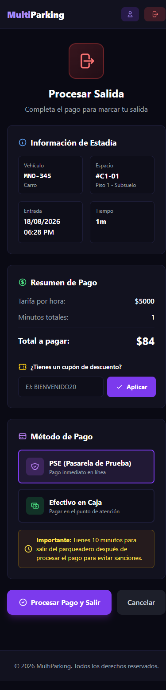

**Verificado en vivo, con cupón aplicado:** se escribió el código `BIENVENIDO20` (20% de descuento) en el campo de cupón y se completó el pago vía PSE para el vehículo `MNO-345`. El descuento se aplicó correctamente al procesar el pago: el recibo final mostró Subtotal $167 → Descuento Bienvenida **-$33** → Total $134, exactamente 20% de descuento.

Pantalla de confirmación: *"¡Pago Exitoso! Tu salida ha sido registrada"*, con Vehículo, Monto pagado, método (Pagado vía PSE), el mismo aviso de los 10 minutos, y botones **Ver Recibo** / **Volver al Dashboard**.

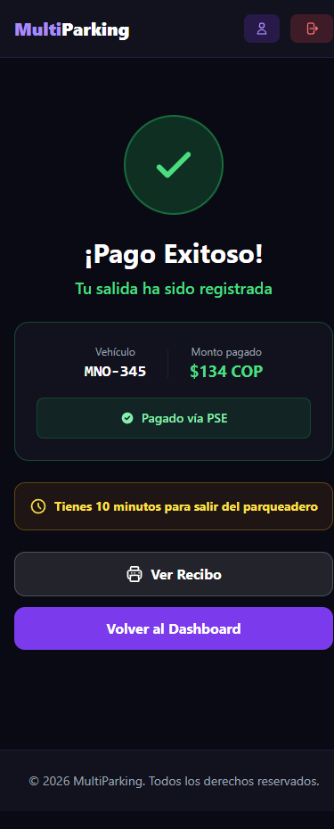

### 4.6 Perfil, fidelidad y cuponera

**Mi Perfil** (ícono de persona en la barra superior → `/cliente/perfil/`): muestra **Datos personales** (Nombre, Documento, Correo, Teléfono, Rol) y el **Programa de Fidelidad**: contador de stickers (ej. "0/10"), 10 casillas visuales (con un ícono de regalo en la última), el texto *"Ganas un sello por cada parqueo mayor a 1 hora"*, y un mensaje de progreso (*"Te faltan sellos para tu bono"* si aún no se completa la meta).

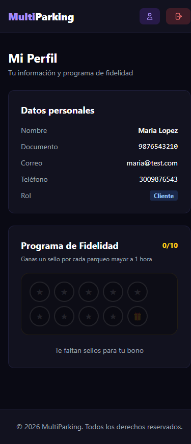

Cuando el cliente completa la meta de stickers, aparece un botón para **reclamar el bono** (cupón de 100% de descuento) — no se verificó este paso porque ninguna cuenta de prueba disponible tenía la meta completa en el momento de esta revisión.

**Mi Cuponera** (accesible desde el perfil o directamente en `/cliente/cuponera/`): lista los cupones de fidelidad ya reclamados por el cliente, con la advertencia "¡úsalos antes de que venzan!". Si no hay cupones, muestra un estado vacío con el botón **Ver mi perfil**.

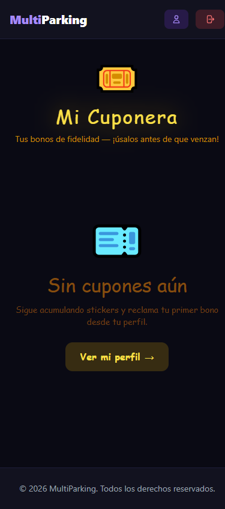

**Hallazgo técnico verificado:** al cargar `/cliente/cuponera/` aparece un error real en la consola del navegador — la página intenta cargar una hoja de estilos de Google Fonts (`fonts.googleapis.com`, para las fuentes "Bangers" y "Space Grotesk") que **la Política de Seguridad de Contenido (CSP) del sitio bloquea explícitamente**, porque la directiva `style-src` del middleware de seguridad (`SecurityHeadersMiddleware`) solo permite `'self'`, `'unsafe-inline'` y los CDNs de Tailwind/jsdelivr/cloudflare — no `fonts.googleapis.com`. El error exacto: *"Loading the stylesheet ... violates the following Content Security Policy directive: style-src ..."*. En esta prueba la página seguía viéndose con una tipografía estilizada de todas formas (posiblemente por una fuente de reserva similar), por lo que el impacto visual observado fue mínimo, pero es un error real y reproducible que vale la pena corregir — o quitando esa fuente externa, o agregando `fonts.googleapis.com`/`fonts.gstatic.com` a la política CSP.

### 4.7 Historial de pagos y recibo

La sección **Historial de Pagos** del dashboard lista los pagos anteriores del cliente: monto, vehículo, duración en horas, estado (Pagado) y fecha.

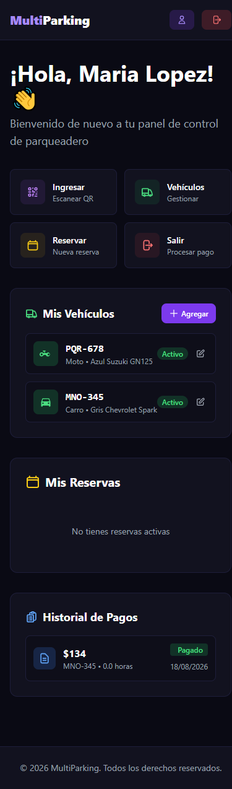

Cada pago puede abrirse como recibo imprimible en `/recibo/<id>/` — el mismo diseño de recibo que ven Administrador y Vigilante, pero el Cliente **solo puede ver sus propios recibos** (la vista redirige a `/dashboard/` si se intenta abrir el recibo de otro usuario).

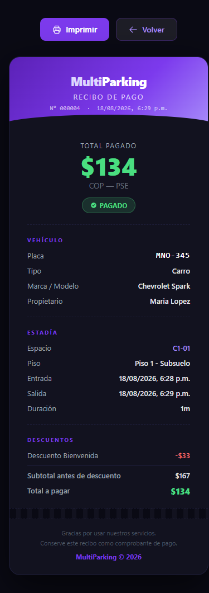

Cuando se aplicó un cupón, el recibo incluye una sección adicional **Descuentos** con el nombre del cupón, el monto descontado, el subtotal antes de descuento y el total final — detalle que no aparece en un recibo sin cupón (ver el recibo del Manual del Vigilante, sección 4.6, para comparar).

---

## 5. Flujos completos

### 5.1 Ciclo de vida completo: agregar vehículo → reservar → cancelar (verificado en vivo)

1. Dashboard → Agregar (Mis Vehículos) → completar placa/tipo → Agregar Vehículo.
2. Dashboard → Reservar → elegir el vehículo recién agregado (o cualquiera existente) → elegir fecha/hora/espacio → Confirmar Reserva.
3. La reserva aparece en "Mis Reservas" con estado Pendiente.
4. Si ya no se necesita: Cancelar (confirmar en el diálogo) → la reserva desaparece del dashboard del cliente.

### 5.2 Ciclo de vida completo: ingresar por QR → pagar → ver recibo (verificado en vivo)

1. Dashboard → Ingresar (Escanear QR) → si no hay cámara, "Ingresar sin escanear".
2. Elegir el vehículo que ingresa → Ingresar al Parqueadero → pantalla de bienvenida con el espacio asignado automáticamente.
3. Cuando se va a retirar: Dashboard → Salir (Procesar pago) → revisar el resumen de pago, opcionalmente aplicar un cupón, elegir método de pago (PSE o Efectivo) → Procesar Pago y Salir.
4. Pantalla "¡Pago Exitoso!" → Ver Recibo para el comprobante imprimible.

## 6. Errores y problemas frecuentes

| Problema | Causa observada | Qué hacer |
|---|---|---|
| "Ya tienes el vehículo X dentro del parqueadero" al intentar ingresar | Un cliente no puede tener dos vehículos propios ingresados a la vez si ya hay uno activo | Registrar la salida del vehículo actual antes de ingresar otro |
| "No tienes ningún vehículo dentro del parqueadero" al ir a Salir | No hay ningún parqueo activo asociado a la cuenta | Verificar que el ingreso se haya registrado correctamente primero |
| La tipografía de "Mi Cuponera" se ve distinta a lo esperado / error en consola sobre Google Fonts | La Política de Seguridad de Contenido del sitio bloquea la hoja de estilos externa de Google Fonts | Comportamiento conocido (ver sección 4.6); no afecta la funcionalidad, solo la tipografía |
| No aparece botón para eliminar un vehículo | No existe esa función en el panel de cliente por diseño | Desactivar el vehículo (interruptor "Vehículo activo") o solicitar la eliminación a un Administrador |

## 7. Buenas prácticas

- Registrar todos los vehículos propios desde el primer uso, para no tener que crearlos apurado al llegar al parqueadero.
- Revisar el recuadro "Información importante" antes de reservar (anticipación mínima, costo, tiempo de tolerancia).
- Procesar el pago de salida apenas se vaya a retirar el vehículo — hay solo 10 minutos de margen después de pagar.
- Guardar o imprimir el recibo de cada pago como comprobante.
- Revisar el progreso de fidelidad en Mi Perfil periódicamente — el sticker solo se otorga si la permanencia supera 1 hora.

## 8. Preguntas frecuentes

**¿Por qué no puedo eliminar un vehículo, solo editarlo o desactivarlo?**
El panel de cliente no incluye esa función por diseño; se puede desactivar (no aparece disponible para reservas ni ingresos) o solicitar la eliminación completa a un administrador.

**¿Cómo se calcula el valor acumulado mientras mi vehículo está adentro?**
Se calcula en tiempo real según la tarifa activa del tipo de espacio, por minuto transcurrido — se actualiza en pantalla sin recargar la página.

**¿Puedo pagar con tarjeta?**
Las opciones disponibles en el demo son PSE (pasarela en línea, marcada como "de prueba") y Efectivo en caja.

**¿Qué pasa si no confirmo mi reserva o no llego a tiempo?**
Según el propio formulario de reserva, si no llegas en los primeros 15 minutos la reserva puede cancelarse automáticamente.

## 9. Glosario

| Término | Significado |
|---|---|
| Estado de Parqueo | Tarjeta del dashboard que muestra el vehículo, espacio, tiempo y valor acumulado en tiempo real mientras el cliente está parqueado |
| Entrada Sin Reserva | Flujo de autoservicio para ingresar sin haber reservado previamente; el espacio se asigna automáticamente |
| PSE | Pasarela de pago en línea (marcada como "de prueba" en el demo) |
| Sticker | Unidad de fidelización que se acumula por cada parqueo mayor a 1 hora |
| Cuponera | Listado de cupones de fidelidad ya reclamados por el cliente |
| Reserva "Pendiente" | Estado inicial de una reserva recién creada, antes de que el cliente llegue o la cancele |
| Valor acumulado | Costo estimado en tiempo real de la estadía actual, antes de procesar la salida |
