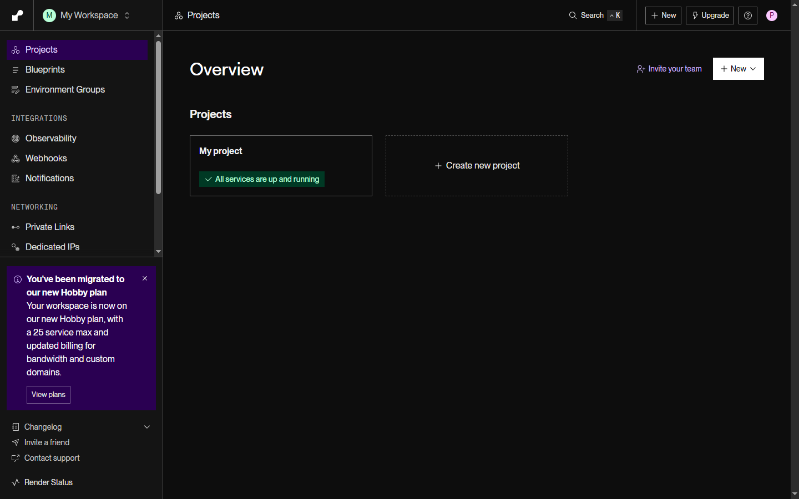
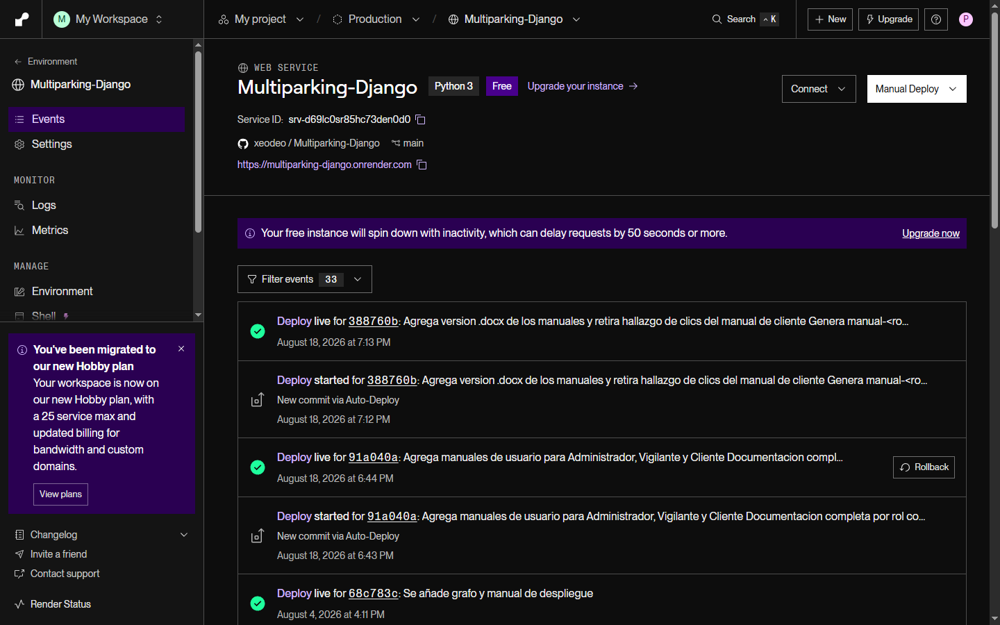
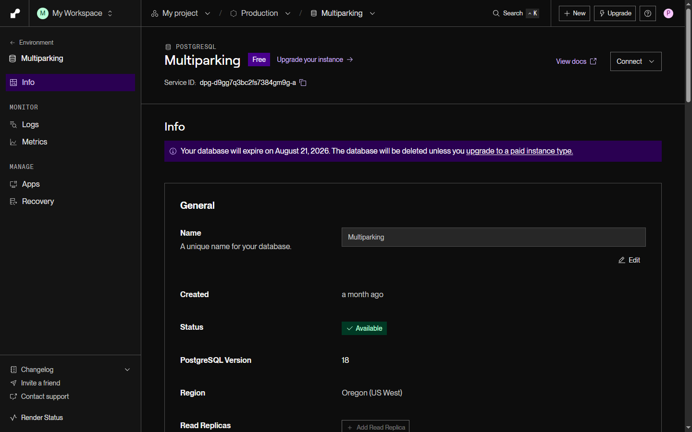
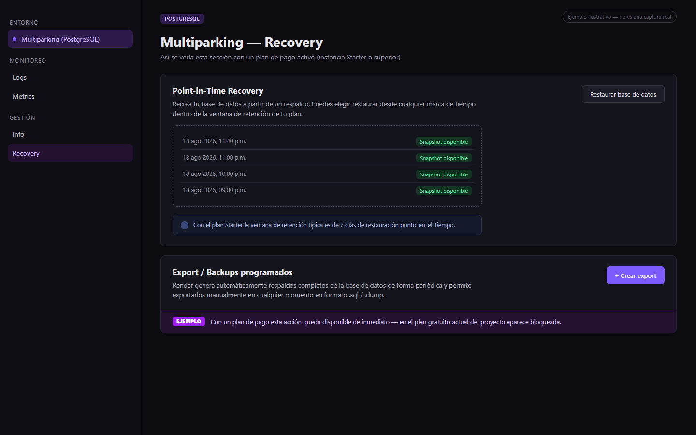
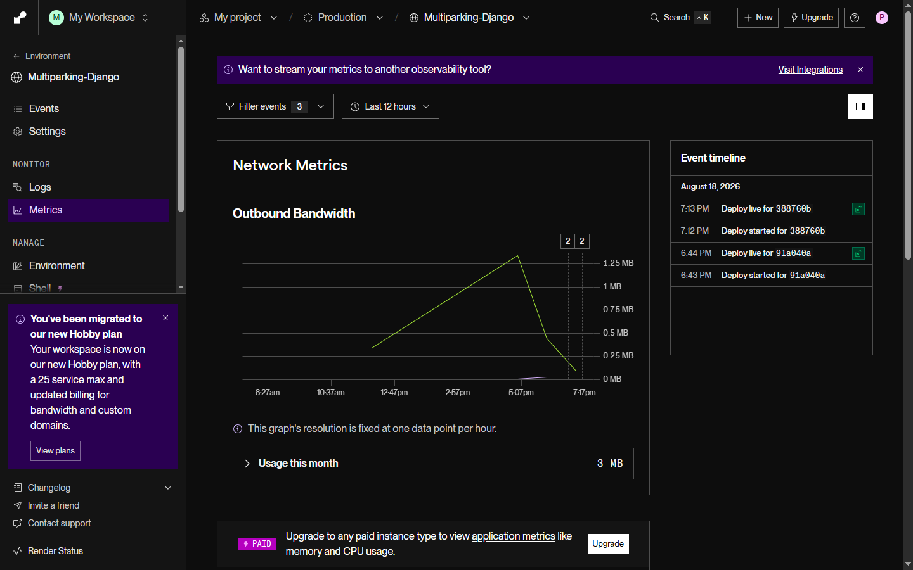

# Manual de Despliegue — Sistema de Información Multiparking

Aprendiz: Kevin Santiago Pinto López

Análisis y Desarrollo de Software (ADSO)

Ficha: 3119175

Centro de Diseño y Metrología

Servicio Nacional de Aprendizaje (SENA)

Agosto 2026

Bogotá D.C.

---

## Índice

1. [Definición del Entorno Técnico](#1-definición-del-entorno-técnico)
   - [1.1 Comparativo de Entornos](#11-comparativo-de-entornos)
   - [1.2 Especificaciones del plan de Render utilizado](#12-especificaciones-del-plan-de-render-utilizado)
   - [1.3 Prerrequisitos Generales de Infraestructura](#13-prerrequisitos-generales-de-infraestructura)
   - [1.4 Modelo de precio del software Multiparking](#14-modelo-de-precio-del-software-multiparking)
2. [Protocolo de Acceso y Despliegue](#2-protocolo-de-acceso-y-despliegue)
   - [2.1 Entorno único de despliegue — Render](#21-entorno-único-de-despliegue--render)
   - [2.2 Variables de entorno](#22-variables-de-entorno)
   - [2.3 Protocolo de despliegue en producción](#23-protocolo-de-despliegue-en-producción--configuración-del-servicio-en-render)
   - [2.4 Rama de despliegue y pruebas previas](#24-rama-de-despliegue-y-pruebas-previas)
   - [2.5 Ventana de Mantenimiento y Criterios Go / No-Go](#25-ventana-de-mantenimiento-y-criterios-go--no-go)
3. [Gestión de la Base de Datos](#3-gestión-de-la-base-de-datos)
   - [3.1 Estado inicial de la base de datos](#31-estado-inicial-de-la-base-de-datos)
   - [3.2 Inicialización de la base de datos](#32-inicialización-de-la-base-de-datos)
   - [3.3 Limpieza de base de datos en producción](#33-limpieza-de-base-de-datos-en-producción)
   - [3.4 Plan de Migración de Datos](#34-plan-de-migración-de-datos)
4. [Plan de Contingencia y Rollback](#4-plan-de-contingencia-y-rollback)
   - [4.1 Política de backup obligatorio](#41-política-de-backup-obligatorio)
   - [4.2 Procedimiento de backup](#42-procedimiento-de-backup)
   - [4.3 Plan de rollback — paso a paso](#43-plan-de-rollback--paso-a-paso)
   - [4.4 Tiempos estimados de rollback](#44-tiempos-estimados-de-rollback)
   - [4.5 Plan de Restauración y Pruebas de Drill](#45-plan-de-restauración-y-pruebas-de-drill-simulacros-de-rollback)
5. [Verificación y Pruebas](#5-verificación-y-pruebas)
   - [5.1 Pruebas previas al despliegue](#51-pruebas-previas-al-despliegue)
   - [5.2 Plan de revisión post-despliegue](#52-plan-de-revisión-post-despliegue)
   - [5.3 Checklist de despliegue exitoso](#53-checklist-de-despliegue-exitoso)
6. [Matriz de Responsabilidades (RACI) y Directorio de Contactos](#6-matriz-de-responsabilidades-raci-y-directorio-de-contactos)
   - [6.1 Matriz RACI](#61-matriz-raci)
   - [6.2 Directorio de Contactos](#62-directorio-de-contactos)

---

## 1. Definición del Entorno Técnico

Esta sección describe los componentes tecnológicos que conforman el sistema Multiparking en su estado actual, desplegado íntegramente sobre la plataforma Render.com. A diferencia de esquemas con un entorno de pruebas y un entorno de producción alojados en proveedores distintos, Multiparking utiliza un único proveedor de hosting (Render) tanto para el desarrollo/pruebas antes de cada publicación como para la operación en producción; el aislamiento entre ambos momentos del ciclo de vida se logra mediante pruebas locales previas (equipo del aprendiz) y una rama de integración en Git, no mediante servidores físicos separados.

### 1.1. Comparativo de Entornos

| Componente | Entorno Local (desarrollo) | Producción (Render) |
|---|---|---|
| Sistema Operativo | El del equipo del aprendiz (Windows), con Python instalado directamente | Gestionado por Render (contenedor Linux interno, no configurable) |
| Servidor Web | Servidor de desarrollo de Django (`python manage.py runserver`) | Gunicorn (WSGI) detrás de la infraestructura interna de Render |
| Base de Datos | MySQL 8.0 (utf8mb4), instalada localmente | PostgreSQL (Render Managed Database) |
| Runtime Backend | Python 3.13 + Django | Python 3 (detectado automáticamente por Render) + Django |
| Frontend | Plantillas Django renderizadas por el mismo servidor de desarrollo | Plantillas Django renderizadas por el mismo Web Service (no hay frontend separado) |
| Gestor de despliegue | Manual (el aprendiz ejecuta y prueba en su equipo) | Render (CI/CD automático desde GitHub) |
| Dominio | `localhost:8000` | `multiparking-django.onrender.com` (gratuito, subdominio de Render) |
| SSL/HTTPS | No aplica (tráfico local) | Automático, gestionado por Render |
| Costo mensual | $0 (equipo propio del aprendiz) | $0 USD mientras el Web Service y la base de datos permanezcan en el plan gratuito (Free) |

### 1.2. Especificaciones del plan de Render utilizado

Multiparking no se despliega sobre un VPS propio; se apoya en los planes gratuitos ("Free") que Render ofrece tanto para el Web Service como para la base de datos administrada. Cada uno tiene límites de recursos que son relevantes para la operación del sistema:

| Componente | Especificación (plan Free actual) |
|---|---|
| Servicio | Web Service `Multiparking-Django` |
| Runtime | Python 3 |
| Repositorio conectado | `xeodeo/Multiparking-Django`, rama `main` |
| Comportamiento en inactividad | El servicio "se duerme" tras un periodo sin tráfico; la siguiente petición puede tardar 50 segundos o más en responder mientras se reactiva |
| Base de datos | PostgreSQL administrado, nombre del servicio `Multiparking` |
| RAM / CPU de la base de datos | 256 MB de RAM, 0.1 CPU (plan Free) |
| Almacenamiento de la base de datos | 1 GB |
| Vigencia del plan gratuito de base de datos | 30 días desde su creación; Render notifica la fecha de expiración dentro del propio panel y elimina la base de datos si no se actualiza a un plan de pago antes de esa fecha |
| Alta disponibilidad (réplicas) | No disponible en el plan Free; requiere una instancia de pago (Starter o superior) |
| Métricas de CPU/memoria de aplicación | No disponibles en el plan Free; el plan Free solo expone métricas de red (ancho de banda saliente) |

*Ilustración 1. Panel general del proyecto "Multiparking" en Render, con el Web Service en ejecución.*

**Costo si se actualiza a un plan de pago de Render:** el proyecto opera hoy en $0 USD (plan Free), pero conviene presupuestar lo que costaría eliminar las limitaciones del plan gratuito (sin backups, con expiración de la base de datos cada 30 días y con el "dormido" del servicio tras inactividad):

| Componente | Plan | Precio aproximado (USD/mes) | Beneficio principal |
|---|---|---|---|
| Web Service (Hosting) | Starter | ~$7 USD/mes | El servicio deja de "dormirse"; respuesta inmediata siempre |
| Web Service (Hosting) | Standard | ~$25 USD/mes | Más RAM/CPU (2 GB / 1 vCPU) para mayor tráfico |
| Base de datos PostgreSQL | Starter (Basic, ~1 GB RAM) | ~$6 a $19 USD/mes según RAM | Sin fecha de expiración, con backups automáticos y Point-in-Time Recovery |

*Nota: precios de referencia de Render.com consultados en agosto de 2026; Render puede ajustarlos, por lo que se recomienda confirmarlos en el panel antes de presupuestar una actualización real.*

Dado que estos límites son inherentes al plan gratuito y no a un error de configuración, cualquier crecimiento real del proyecto (tráfico constante, necesidad de backups automáticos o de alta disponibilidad) requiere presupuestar la migración a un plan de pago de Render antes de que se cumplan los plazos de expiración indicados por la propia plataforma.

### 1.3. Prerrequisitos Generales de Infraestructura (Independiente del Proveedor)

Si en el futuro se decide migrar el entorno de producción a otro proveedor de nube distinto de Render (como AWS, DigitalOcean, un VPS de Hostinger u otro), los prerrequisitos generales de infraestructura a cumplir son:

- Sistema Operativo: Linux (Ubuntu 22.04 LTS o Debian 12 recomendado).
- Acceso: acceso raíz (root) o usuario con privilegios `sudo` vía SSH en el puerto 22 o un puerto personalizado.
- Hardware mínimo: 1 vCPU, 1 GB de RAM (2 GB recomendado) y 10 GB de almacenamiento SSD/NVMe — Multiparking es una aplicación Django monolítica sin frontend separado, por lo que sus requerimientos de hardware son considerablemente menores a los de un stack con frontend y backend independientes.
- Puertos abiertos (firewall / security groups):
  - 22/TCP (SSH — administración remota).
  - 80/TCP (HTTP — redirección y solicitud de certificados SSL).
  - 443/TCP (HTTPS — tráfico seguro web).
  - 5432/TCP (PostgreSQL, solo si la base de datos se expone fuera de la red interna del proveedor).
- Runtime: Python 3.11+ instalado, junto con un gestor de procesos WSGI (Gunicorn) y, opcionalmente, un proxy inverso (Nginx) para servir archivos estáticos y gestionar TLS.
- Motor de base de datos: PostgreSQL 14+ instalado o accesible como servicio administrado.
- Dominio público: un nombre de dominio registrado con acceso al panel DNS, para configurar registros A/CNAME apuntando al proveedor elegido.

### 1.4. Modelo de precio del software Multiparking

Multiparking se comercializa mediante una **suscripción mensual** (ciclo de facturación de 30 días), no como licencia única ni como venta perpetua:

| Concepto | Valor |
|---|---|
| Modelo comercial | Suscripción recurrente, renovación cada 30 días |
| Precio de la suscripción | **$30.000 COP/mes** |
| Incluye | Acceso completo al sistema (Administrador, Vigilante, Cliente) sobre la infraestructura descrita en este manual |

Este valor es independiente del costo de hosting (sección 1.2): la suscripción cubre el uso del software, mientras que el costo de infraestructura (Render) se asume aparte según el plan elegido.

---

## 2. Protocolo de Acceso y Despliegue

### 2.1. Entorno único de despliegue — Render

El despliegue de Multiparking se realiza de manera automática al conectar el repositorio de GitHub `xeodeo/Multiparking-Django` con Render. No se requiere intervención manual en el servidor: cada `push` a la rama `main` dispara un nuevo despliegue (Auto-Deploy). Render clona el repositorio, instala las dependencias declaradas en `requirements.txt`, ejecuta el script de construcción (`build.sh`) y finalmente levanta el proceso con Gunicorn.

### 2.2. Variables de entorno

Las siguientes variables de entorno deben estar configuradas en el panel de Render, bajo la sección **Environment** del Web Service, para el correcto funcionamiento del sistema. Por tratarse de credenciales, esta sección se documenta únicamente en forma de tabla descriptiva — Render enmascara los valores ya guardados y solo permite revelarlos uno a uno desde el propio panel, por lo que no se incluye una captura de esta pantalla en este manual.

| Variable | Descripción |
|---|---|
| `SECRET_KEY` | Clave secreta de Django utilizada para firmar sesiones, tokens CSRF y otros datos criptográficos internos. |
| `DATABASE_URL` | Cadena de conexión a la base de datos PostgreSQL administrada por Render (provista automáticamente por Render al vincular el servicio de base de datos). |
| `RENDER` | Variable que Render define automáticamente en el entorno de producción; `settings.py` la usa para desactivar `DEBUG` sin necesidad de configurarla manualmente. |
| `RENDER_EXTERNAL_HOSTNAME` | Definida automáticamente por Render con el dominio público del servicio; se agrega a `ALLOWED_HOSTS` en tiempo de ejecución. |
| `GMAIL_USER` | Correo de Gmail usado como remitente principal de notificaciones (recuperación de contraseña, alertas de novedades). |
| `GMAIL_APP_PASSWORD` | Contraseña de aplicación de Gmail asociada a `GMAIL_USER`. |
| `EMAIL_FROM` | Nombre y correo que se muestran como remitente en los correos enviados por el sistema. |
| `SENDGRID_API_KEY` | Clave de API de SendGrid, usada como mecanismo de envío de correo alterno si no se define `GMAIL_APP_PASSWORD`. |

### 2.3. Protocolo de despliegue en producción — Configuración del servicio en Render

Para el entorno de producción se utiliza Render como plataforma de despliegue continuo (PaaS), sin administración manual de servidores. A continuación se detalla el protocolo completo de configuración inicial del servicio, desde la creación de la cuenta hasta el primer despliegue verificado:

| Paso | Descripción |
|---|---|
| Paso 1 | Crear una cuenta en Render (render.com) y un nuevo **Web Service**, autorizando el acceso al repositorio `xeodeo/Multiparking-Django`. |
| Paso 2 | Configurar el **Build Command**: `pip install -r requirements.txt && python manage.py collectstatic --no-input && python manage.py migrate` (definido en `build.sh`). |
| Paso 3 | Configurar el **Start Command**: `gunicorn multiparking.wsgi`. |
| Paso 4 | Registrar todas las variables de entorno del punto 2.2 en la sección **Environment** del servicio. |
| Paso 5 | Crear un servicio de **PostgreSQL** independiente en Render (nombre `Multiparking`) y copiar su `DATABASE_URL` interna a la variable de entorno del Web Service. |
| Paso 6 | Confirmar que la rama conectada para despliegue automático sea `main`. |
| Paso 7 | Ejecutar el primer despliegue manual desde el panel (**Manual Deploy → Deploy latest commit**) para validar que el build y el arranque sean exitosos. |
| Paso 8 | Verificar en la pestaña **Logs** que el proceso de Gunicorn inició sin errores y que las migraciones se aplicaron correctamente. |
| Paso 9 | (Opcional) Configurar un dominio personalizado desde **Settings → Custom Domains**, apuntando los registros DNS del dominio hacia Render. |
| Paso 10 | A partir de este punto, cada `push` a `main` en GitHub dispara automáticamente un nuevo despliegue sin pasos manuales adicionales. |

**Costo estimado de un dominio personalizado (Paso 9, opcional):** mientras no se adquiera un dominio propio, el sistema sigue disponible de forma gratuita en `multiparking-django.onrender.com`. En caso de querer adquirir uno en el futuro, se realizó una búsqueda de disponibilidad y precios en un buscador de dominios, con el siguiente resultado para el nombre "multiparking":

| Dominio | Disponibilidad | Precio primer año | Precio renovación / condición |
|---|---|---|---|
| `multiparking.com` | No disponible (ya registrado) | — | Un servicio de gestión de dominios ofrece intermediar su adquisición por USD $99.99 |
| `mymultiparking.com` | Disponible | USD $0.01 (promoción, con registro de 3 años — 33% de ahorro) | USD $22.99/año en renovaciones posteriores |
| `multiparking.org` | Disponible | USD $9.99 (promoción) | USD $23.99/año en renovaciones posteriores |
| `multiparking.ai` | Disponible (dominio premium) | USD $49.99 (promoción, solo con plazo mínimo de 2 años) | USD $159.99 por el plazo estándar |

Estos precios corresponden a una cotización puntual de un proveedor de dominios (agosto de 2026) y están sujetos a cambio; se incluyen únicamente como referencia para presupuestar la adquisición de un dominio propio, ya que actualmente el proyecto opera sin costo alguno sobre el subdominio gratuito que Render asigna por defecto.

*Ilustración 2. Servicio web "Multiparking-Django" en Render, con el repositorio de GitHub conectado, la rama `main`, la URL pública y el historial de despliegues.*

*Ilustración 3. Base de datos PostgreSQL "Multiparking" creada en Render (Paso 5), vinculada al Web Service mediante `DATABASE_URL`.*

### 2.4. Rama de despliegue y pruebas previas

| Componente | Descripción |
|---|---|
| Rama de producción | `main` — es la única rama conectada al Auto-Deploy de Render. |
| Rama de integración | `develop` (recomendada para el flujo de trabajo, aunque el estado actual del repositorio pueda concentrarse en `main` por tratarse de un proyecto de un solo desarrollador). |
| Cómo se prueba antes de publicar | Todo cambio se ejecuta y verifica primero en el entorno local: `python manage.py runserver`, con la base de datos MySQL local y, cuando aplica, `python manage.py test`. Solo cuando el cambio funciona correctamente en local se integra a `develop` (o directamente a una rama de trabajo) y finalmente se fusiona a `main`, lo que dispara el despliegue real en Render. |
| Estrategia | Ningún cambio se sube directamente a producción sin haber sido ejecutado al menos una vez en el entorno local — Render no reemplaza las pruebas locales, solo automatiza la publicación. |

### 2.5. Ventana de Mantenimiento y Criterios Go / No-Go

**Ventana horaria programada:** todo despliegue que implique cambios estructurales en la base de datos (nuevas migraciones, cambios de modelos) debe realizarse preferiblemente en horarios de bajo uso del parqueadero (madrugada o fin de semana), para minimizar el impacto de la breve interrupción que genera un nuevo despliegue en Render.

**Criterios de aborto (Go / No-Go):**

- Criterio NO-GO 1: si `python manage.py migrate` reporta errores de integridad referencial o conflictos de migraciones no resueltos durante el build.
- Criterio NO-GO 2: si, tras el despliegue, la página principal (`/`) o el formulario de login (`/login/`) no responden correctamente en al menos 3 intentos consecutivos.
- Criterio NO-GO 3: si las pruebas de humo post-despliegue detectan fallas críticas en el registro de ingreso/salida de vehículos (`/guardia/`, `/parqueadero/`) o en el cálculo de pagos.

En caso de declararse el estado NO-GO, el responsable del despliegue (en este proyecto, el propio desarrollador) debe iniciar de inmediato el protocolo de rollback descrito en la sección 4.

---

## 3. Gestión de la Base de Datos

### 3.1. Estado inicial de la base de datos

| Entorno | Descripción |
|---|---|
| Entorno local (MySQL) | Se inicializa mediante `python manage.py makemigrations` seguido de `python manage.py migrate`, que crea todas las tablas según los modelos de cada app Django, sin datos de prueba. |
| Entorno de producción (Render, PostgreSQL) | Se inicializa vacía con `python manage.py migrate` (incluido en `build.sh`, se ejecuta en cada despliegue). Los datos mínimos (usuario administrador, catálogos base) se cargan mediante scripts dedicados, no manualmente. |

### 3.2. Inicialización de la base de datos

| Paso | Comando / Acción |
|---|---|
| Migraciones (ambos entornos) | `python manage.py makemigrations` y `python manage.py migrate` |
| Usuario administrador inicial | `python create_admin.py` (crea `admin@multiparking.com` / `admin123`) |
| Datos de prueba para Render | `python scripts/render_datos_prueba.py` (siembra datos compatibles con PostgreSQL) |
| Reinicio completo (solo entorno local) | `python scripts/reiniciar_base_datos.py` (elimina todas las tablas, regenera migraciones y siembra datos completos de demostración) |
| Verificación | `python manage.py dbshell`, o bien el botón **Connect → PSQL Command** del panel de la base de datos en Render |

### 3.3. Limpieza de base de datos en producción

En caso de necesitar limpiar datos en producción sin romper las relaciones entre tablas, se debe respetar el orden de dependencias por llave foránea del modelo de datos de Multiparking, eliminando primero las tablas "hijas" y al final las tablas "padre":

| Orden | Tablas a limpiar |
|---|---|
| Orden 1 | `cupones_aplicados`, `novedades`, `fidelidad_stickers` |
| Orden 2 | `pagos` |
| Orden 3 | `reservas` |
| Orden 4 | `inventario_parqueo` |
| Orden 5 | `vehiculos` |
| Orden 6 | `espacios`, `tarifas`, `cupones` |
| Orden 7 | `tipos_espacio`, `pisos` |
| Orden 8 | `usuarios` |

Nota: usar `DELETE FROM tabla;` para limpiar datos conservando la estructura. Usar `DROP TABLE` solo si se va a reiniciar completamente el esquema mediante una migración nueva.

### 3.4. Plan de Migración de Datos

Aunque Multiparking opera hoy sobre un único proveedor (Render), este plan aplica igualmente al migrar datos entre dos instancias de Render (por ejemplo, al pasar la base de datos gratuita actual a una instancia de pago antes de su fecha de expiración) o hacia un proveedor distinto en el futuro:

1. **Congelamiento de escritura (ventana de mantenimiento):** notificar la ventana de mantenimiento y, de ser posible, pausar temporalmente el ingreso de nuevos vehículos mientras se ejecuta la migración.
2. **Extracción de la base de datos (dump):** ejecutar `pg_dump` contra la cadena de conexión externa (**External Database URL**, visible en el panel de la base de datos en Render) para generar un archivo `multiparking_migracion.sql` con la estructura y los datos completos.
3. **Transferencia segura:** transferir el archivo resultante al destino final (otra instancia de Render, un VPS, etc.) mediante `scp` o el mecanismo de transferencia que ofrezca el proveedor destino.
4. **Importación en el nuevo entorno:** restaurar la información con `psql "<DATABASE_URL_DESTINO>" < multiparking_migracion.sql`.
5. **Aplicación de migraciones Django:** ejecutar `python manage.py migrate` en el nuevo entorno para asegurar que el esquema quede sincronizado con la última versión del código.
6. **Validación de integridad de datos:** ejecutar consultas de conteo (`SELECT COUNT(*)`) sobre las tablas principales (`usuarios`, `vehiculos`, `espacios`, `inventario_parqueo`, `pagos`) y comparar contra los conteos del entorno de origen antes de dar por cerrada la migración.

---

## 4. Plan de Contingencia y Rollback

### 4.1. Política de backup obligatorio

Antes de realizar cualquier migración estructural o cambio de alto impacto en producción, es obligatorio generar un respaldo completo de la base de datos de Multiparking. Esta política es aún más crítica dado que el plan gratuito de PostgreSQL en Render no ofrece backups automáticos (ver sección 4.5) — la única copia de seguridad disponible es la que el propio desarrollador genere manualmente.

### 4.2. Procedimiento de backup

| Componente | Descripción |
|---|---|
| Comando de backup | `pg_dump "<External Database URL>" > backup_multiparking_$(date +%Y%m%d_%H%M%S).sql`, usando la cadena de conexión externa que Render expone en la pestaña **Info** de la base de datos. |
| Almacenamiento local | Guardar el archivo `.sql` en una carpeta dedicada del equipo del desarrollador (por ejemplo `backups/multiparking/`). |
| Almacenamiento externo | Sincronizar una copia adicional en un servicio de almacenamiento externo (Google Drive u otro elegido por el desarrollador), como respaldo ante la pérdida del equipo local. |
| Frecuencia recomendada | Antes de cada despliegue con cambios de esquema, y de forma periódica (semanal) mientras el plan de base de datos siga siendo gratuito. |
| Verificación del backup | Restaurar el archivo en una base de datos local de prueba: `psql -U root -d multiparking_test < backup_multiparking_*.sql`. |
| Tiempo estimado del backup | 1 a 3 minutos, dado el volumen de datos actual del proyecto. |

### 4.3. Plan de rollback — paso a paso

Si un despliegue falla o genera errores críticos en producción, se debe ejecutar el siguiente plan de rollback:

| Paso | Descripción |
|---|---|
| Paso 1 — Detectar la falla | Confirmar el estado fallido revisando la pestaña **Logs** y **Events** del Web Service en Render. |
| Paso 2 — Redespliegue del commit anterior | Desde la pestaña **Events**, usar el botón **Rollback** sobre el último despliegue exitoso registrado por Render, lo que revierte el servicio a esa versión de forma inmediata. |
| Paso 3 — Alternativa vía Git | Si el rollback desde el panel no es suficiente, ejecutar `git revert <commit>` (o `git reset --hard <commit_anterior>` seguido de push) sobre la rama `main`, lo que dispara un nuevo Auto-Deploy con el código anterior. |
| Paso 4 — Restaurar base de datos si aplica | Si la falla involucró cambios de esquema o datos corruptos: `psql "<DATABASE_URL>" < backup_multiparking_anterior.sql`. |
| Paso 5 — Verificación | Probar las funcionalidades críticas: login, registro de ingreso/salida de vehículos, cálculo de pagos y reservas. |
| Paso 6 — Registro del incidente | Documentar la causa, el impacto y el tiempo de recuperación del incidente para referencia futura. |
| Paso 7 — Notificación | Informar a la instancia evaluadora del proyecto (SENA) sobre el incidente, su causa y el tiempo de recuperación, cuando el incidente ocurra durante una entrega o sustentación formal. |

El panel de eventos con el botón "Rollback" ya se muestra en la Ilustración 2 (sección 2.3) — es el mismo historial de despliegues desde el que se ejecuta este paso.

### 4.4. Tiempos estimados de rollback

| Acción | Tiempo estimado |
|---|---|
| Rollback de código vía botón "Rollback" de Render | 2 a 5 minutos (tiempo de build + arranque de Gunicorn) |
| Rollback de código vía `git revert` + push | 5 a 10 minutos |
| Restaurar base de datos desde backup | 10 a 15 minutos |
| Rollback completo (código + base de datos) | 15 a 25 minutos |
| Tiempo máximo de inactividad aceptable | 30 minutos |

### 4.5. Plan de Restauración y Pruebas de Drill (Simulacros de Rollback)

Para asegurar que el protocolo de contingencia funcione de manera efectiva ante un evento real, se establecen simulacros periódicos de restauración:

- **Frecuencia:** simulacro de restauración mensual, y de forma adicional antes de cualquier despliegue mayor (cambios de esquema significativos).
- **Entorno aislado:** las pruebas se realizan sobre una base de datos de sandbox/pruebas local (`multiparking_test`), nunca sobre la base de datos de producción.
- **Procedimiento de prueba:**
  1. Tomar el backup `.sql` más reciente disponible.
  2. Restaurarlo en el entorno aislado: `psql -U root -d multiparking_test < backup_multiparking_reciente.sql`.
  3. Ejecutar un chequeo de sanidad de datos: validar que los usuarios existen, que las contraseñas siguen hasheadas correctamente y que los conteos de vehículos/espacios/pagos coinciden con lo esperado.
  4. Registrar la fecha, el tiempo tomado para la restauración (TTR) y el resultado (Exitoso / Fallido) en una bitácora personal del proyecto.

**Limitación real del plan gratuito de Render:** a diferencia de un backup manual gestionado por el desarrollador, Render **no ofrece backups automáticos ni Point-in-Time Recovery en el plan Free** de PostgreSQL — ambas funciones (**Point-in-Time Recovery** y **Export/Backups programados**) están bloqueadas y solo se activan al actualizar la base de datos a una instancia de pago (Starter o superior). Como el proyecto actualmente no cuenta con una cuenta de pago en Render, a continuación se presenta un ejemplo ilustrativo de cómo se vería esta sección del panel una vez actualizada, en lugar de una captura real de la función activa:

*Ilustración 4. Ejemplo ilustrativo (mockup) de la sección "Recovery" de Render con un plan de pago activo — no es una captura real, ya que esta función está bloqueada en el plan gratuito actual del proyecto.*

Mientras el proyecto permanezca en el plan gratuito, el respaldo manual descrito en la sección 4.2 es la **única** copia de seguridad real disponible para Multiparking.

---

## 5. Verificación y Pruebas

### 5.1. Pruebas previas al despliegue

Antes de fusionar cambios a `main`, se debe verificar en el entorno local:

- Que `python manage.py migrate` se ejecute sin errores sobre la base de datos MySQL local.
- Que las vistas afectadas por el cambio respondan correctamente en `http://localhost:8000/`.
- Que no se introdujeron regresiones visibles en los tres roles del sistema (Administrador, Vigilante, Cliente), al menos en los flujos que el cambio pudo afectar.

### 5.2. Plan de revisión post-despliegue

Tras cada despliegue en Render, se revisan los siguientes puntos durante las primeras horas:

| Monitoreo | Descripción |
|---|---|
| Revisión de logs | Revisar la pestaña **Logs** del Web Service en Render inmediatamente después del despliegue, buscando trazas de error (`Traceback`, `500`). |
| Métricas de red | Revisar la pestaña **Metrics** para confirmar tráfico y ancho de banda saliente normales; las métricas de CPU/memoria de la aplicación no están disponibles en el plan Free (ver sección 1.2). |
| Estado de la base de datos | Confirmar en la pestaña **Info** de la base de datos (ver Ilustración 3, sección 2.3) que el estado siga en `Available` y revisar la fecha de expiración vigente del plan gratuito. |
| Disponibilidad del sitio | Acceder a `https://multiparking-django.onrender.com/` y confirmar que la página principal carga y el login funciona. |
| Revisión periódica | Revisar semanalmente el crecimiento de la base de datos (límite de 1 GB en el plan Free) para anticipar la necesidad de actualizar el plan. |

*Ilustración 5. Panel de Métricas de red del Web Service en Render; el aviso inferior indica que las métricas de CPU y memoria de la aplicación requieren una instancia de pago.*

### 5.3. Checklist de despliegue exitoso

- Backup manual realizado antes del despliegue (si el cambio incluye migraciones de esquema).
- Variables de entorno configuradas correctamente en Render (sección 2.2).
- Base de datos migrada correctamente con `python manage.py migrate`.
- Sitio accesible vía HTTPS en `https://multiparking-django.onrender.com/`.
- Login funcional para los tres roles (Administrador, Vigilante, Cliente).
- Endpoints principales verificados manualmente (registro de ingreso/salida, reservas, pagos).
- Certificado SSL activo sin advertencias de seguridad (gestionado automáticamente por Render).
- Logs del Web Service sin errores críticos durante las primeras horas tras el despliegue.

---

## 6. Matriz de Responsabilidades (RACI) y Directorio de Contactos

### 6.1. Matriz RACI

Definición de roles durante la ventana de implantación:

- **R (Responsable):** quien ejecuta la tarea.
- **A (Aprobador):** quien autoriza el paso o toma la decisión final.
- **C (Consultado):** quien provee información técnica o de negocio antes de decidir.
- **I (Informado):** quien recibe reportes del estado del proceso.

A diferencia de un equipo de despliegue tradicional con roles repartidos entre varias personas, Multiparking es un proyecto formativo desarrollado por **un único aprendiz, Kevin Santiago Pinto López**, quien concentra en sí mismo las responsabilidades de Responsable, Aprobador y Consultado en todas las actividades de despliegue. La columna de "Informado" se reserva para la instancia académica evaluadora del proyecto (SENA), que recibe el estado del proceso sin intervenir directamente en su ejecución.

| Actividad de Implantación | Kevin Santiago Pinto López (desarrollador único) | Instancia evaluadora (SENA / Centro de Diseño y Metrología) |
|---|---|---|
| Aprobación de la ventana de mantenimiento | R / A / C | I |
| Ejecución de backup manual de la base de datos | R / A | I |
| Configuración del Web Service y variables de entorno en Render | R / A / C | I |
| Migración y siembra de datos iniciales | R / A / C | I |
| Despliegue en producción (push a `main`) | R / A | I |
| Ejecución de pruebas de humo y verificación post-despliegue | R / A / C | I |
| Declaración de estado Go / No-Go o ejecución de rollback | R / A | I |
| Actualización del plan de Render antes de una fecha de expiración | R / A / C | I |

### 6.2. Directorio de Contactos

Al ser un proyecto de un solo desarrollador, no existe un directorio de guardia con múltiples roles; el siguiente contacto concentra la totalidad de la responsabilidad técnica del sistema:

| Nombre | Rol en el proyecto | Correo electrónico | Canal de contacto |
|---|---|---|---|
| Kevin Santiago Pinto López | Desarrollador y administrador único del sistema Multiparking | pintololpez53@gmail.com | Correo electrónico (no se mantiene una línea telefónica de guardia, al no existir un equipo de soporte adicional) |

Como respaldo institucional, cualquier incidencia relacionada con la evaluación formativa del proyecto puede escalarse al Centro de Diseño y Metrología del SENA, ficha 3119175, a través de los canales académicos habituales.
