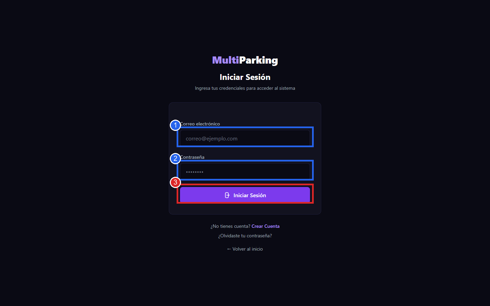
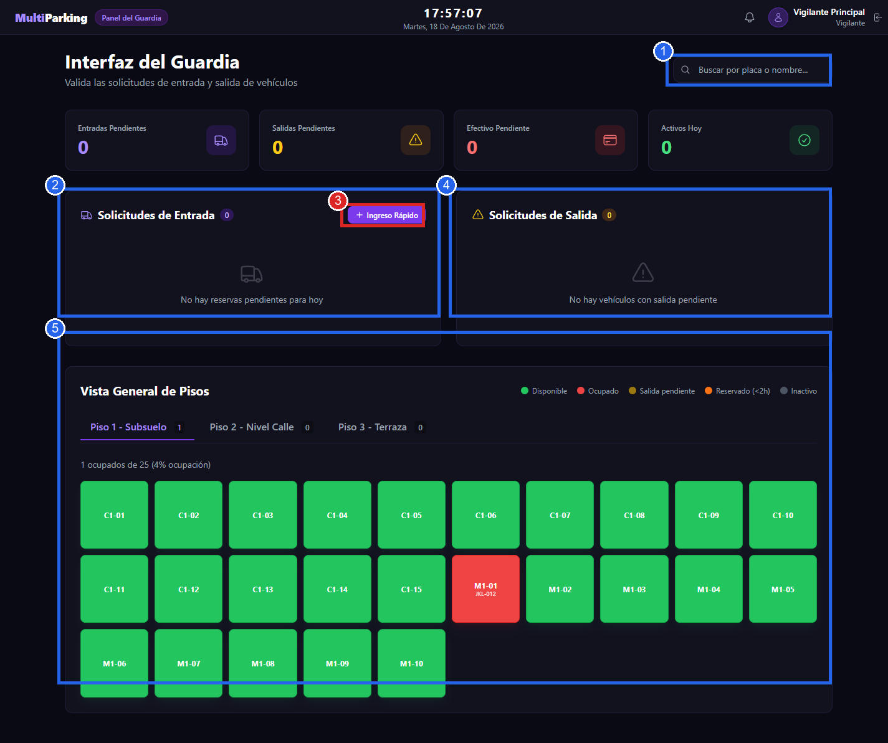
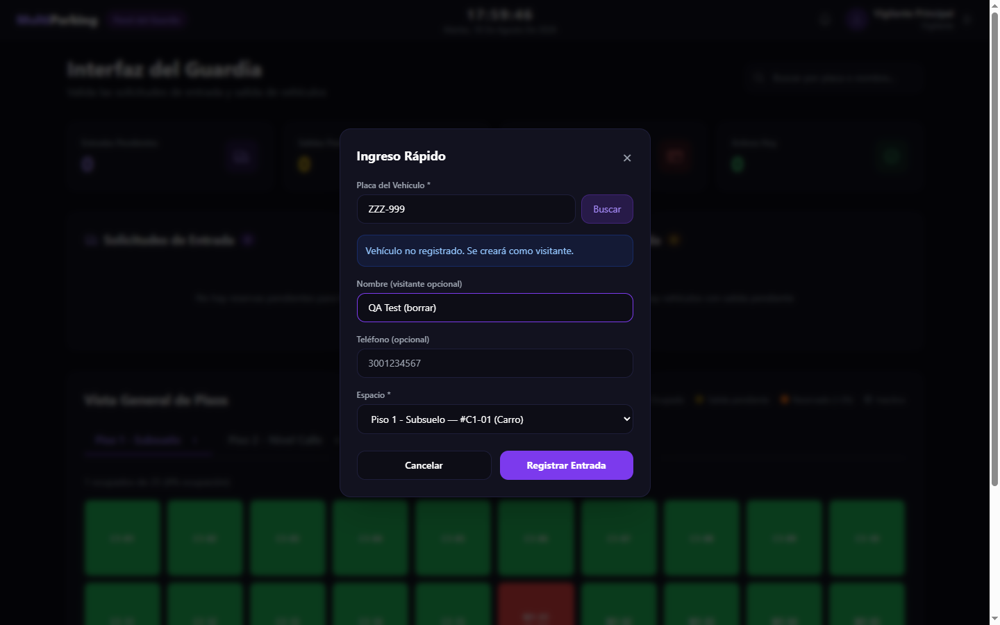
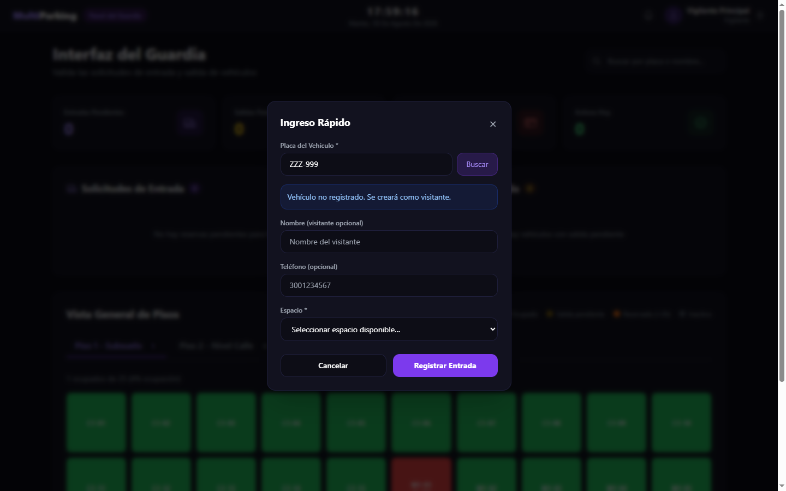
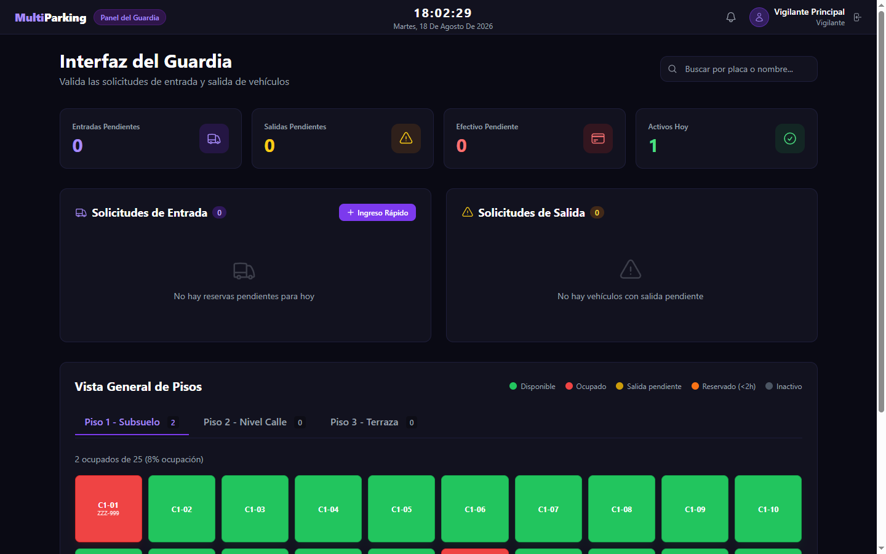
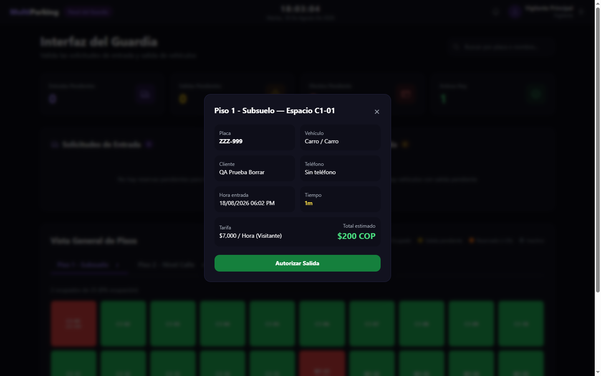
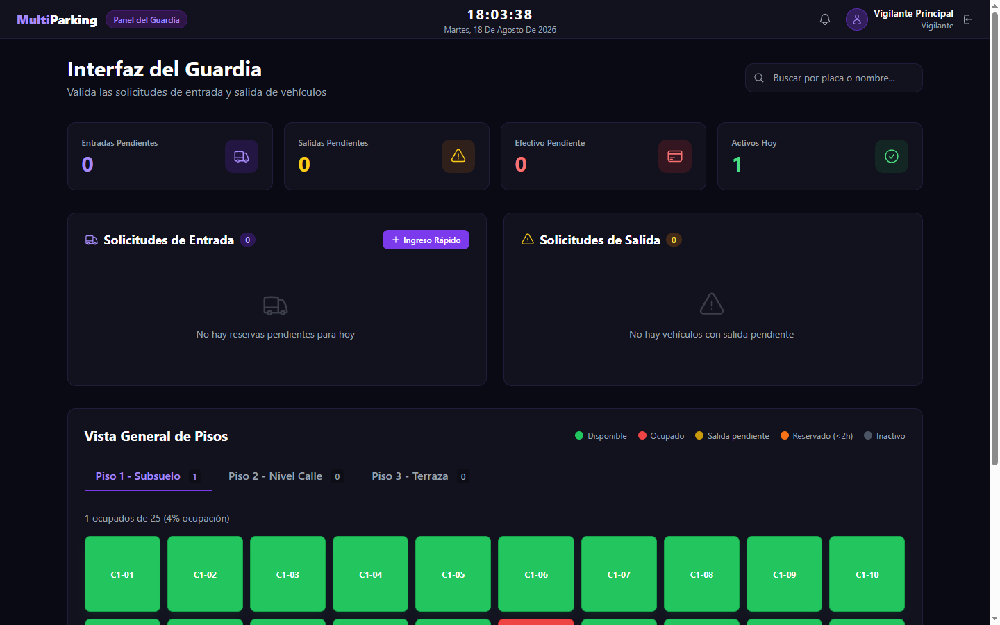
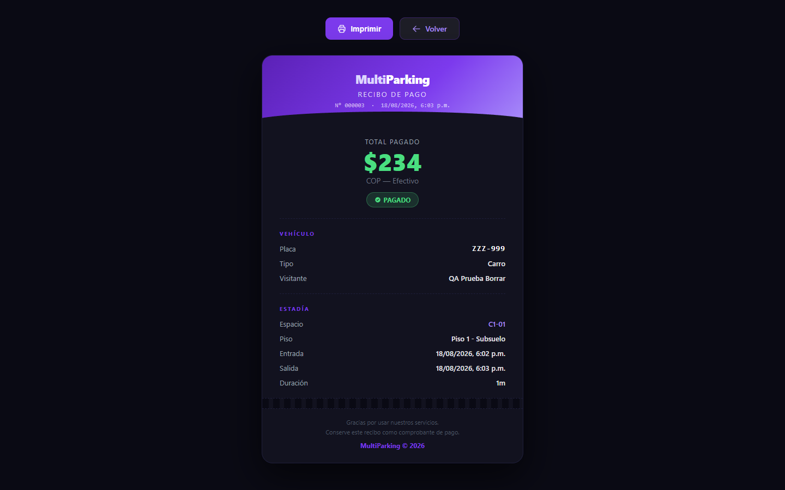

# Manual de Usuario — Rol Vigilante

**Sistema:** MultiParking — Gestión Integral de Parqueaderos Privados
**Versión del manual:** 1.0
**Fecha:** 18 de agosto de 2026
**Rol documentado:** Vigilante (`rolTipoRol = VIGILANTE`)
**Experiencia documentada:** Escritorio (desktop, 1440×900)

---

## Índice

1. [Introducción](#1-introducción)
2. [Acceso al sistema](#2-acceso-al-sistema)
3. [Interfaz principal](#3-interfaz-principal)
4. [Funcionalidades](#4-funcionalidades)
   - [4.1 Registrar ingreso de un vehículo](#41-registrar-ingreso-de-un-vehículo)
   - [4.2 Registrar salida y cobrar](#42-registrar-salida-y-cobrar)
   - [4.3 Aplicar un cupón en el cobro](#43-aplicar-un-cupón-en-el-cobro)
   - [4.4 Buscar un vehículo](#44-buscar-un-vehículo)
   - [4.5 Solicitudes de entrada (reservas del día)](#45-solicitudes-de-entrada-reservas-del-día)
   - [4.6 Recibo de pago](#46-recibo-de-pago)
5. [Flujos completos](#5-flujos-completos)
6. [Errores y problemas frecuentes](#6-errores-y-problemas-frecuentes)
7. [Buenas prácticas](#7-buenas-prácticas)
8. [Preguntas frecuentes](#8-preguntas-frecuentes)
9. [Glosario](#9-glosario)

---

## 1. Introducción

El rol **Vigilante** opera el control físico de acceso del parqueadero: registra el ingreso y la salida de vehículos, cobra en efectivo al momento de la salida, aplica cupones de descuento, y consulta la ocupación en tiempo real. A diferencia del Administrador, el Vigilante **no** tiene acceso a la configuración del sistema (pisos, tipos de espacio, tarifas, cupones, usuarios, reportes) — su interfaz (`/guardia/`) es una única pantalla operativa, sin menú de navegación lateral, pensada para uso rápido durante el turno.

## 2. Acceso al sistema

Igual que los demás roles: `https://multiparking-django.onrender.com/login/` con **Correo electrónico** y **Contraseña**.

Credenciales de vigilante de prueba: `vigilante@multiparking.com` / `vigil123`. Al autenticar, el sistema redirige automáticamente a `/guardia/` (Interfaz del Guardia) para los usuarios con rol `VIGILANTE`.

## 3. Interfaz principal

A diferencia del panel de Administrador, esta pantalla **no tiene menú lateral** — todo ocurre en una sola vista:

- **Barra superior**: nombre del sistema, "Panel del Guardia", reloj/fecha en vivo, campana de notificaciones, nombre del vigilante conectado y botón de cerrar sesión (ícono a la derecha del nombre).
- **Tarjetas de resumen**: Entradas Pendientes, Salidas Pendientes, Efectivo Pendiente, Activos Hoy.
- **Solicitudes de Entrada**: lista de reservas confirmadas para hoy que aún no han llegado, más el botón **Ingreso Rápido** para registrar el ingreso de cualquier vehículo (con o sin reserva).
- **Solicitudes de Salida**: vehículos con salida pendiente de confirmar.
- **Vista General de Pisos**: el mismo mapa de ocupación en tiempo real que ve el Administrador, con pestañas por piso y los mismos colores de estado (Disponible, Ocupado, Salida pendiente, Reservado &lt;2h, Inactivo).
- **Buscador** (arriba a la derecha): por placa o nombre.

## 4. Funcionalidades

### 4.1 Registrar ingreso de un vehículo

**Qué hace:** da entrada a un vehículo, asignándole un espacio disponible. Funciona tanto para vehículos de clientes registrados como para visitantes sin cuenta.
**Cómo acceder:** botón **Ingreso Rápido** en el panel "Solicitudes de Entrada".

1. Clic en **Ingreso Rápido**.
2. Escribir la **Placa del Vehículo** y clic en **Buscar**.
   - Si la placa ya existe en el sistema, el sistema completa automáticamente el nombre y teléfono de contacto asociados (endpoint `guardia/api/buscar-vehiculo/`).
   - Si la placa no existe, aparece el aviso **"Vehículo no registrado. Se creará como visitante."**

3. Si es un visitante nuevo, opcionalmente completar **Nombre (visitante opcional)** y **Teléfono (opcional)**.
4. Elegir el **Espacio** de la lista (agrupada por piso, con el tipo de espacio entre paréntesis — ej. "Piso 1 - Subsuelo — #C1-01 (Carro)"). Solo aparecen espacios en estado Disponible.
5. Clic en **Registrar Entrada**.

**Resultado esperado:** el modal se cierra, el contador "Activos Hoy" sube, y el espacio elegido pasa a color rojo (Ocupado) en la Vista General de Pisos, mostrando la placa dentro del recuadro.

**⚠️ Validación importante verificada en vivo:** el campo **Nombre** solo acepta **letras, tildes y espacios** — nada de números, guiones ni paréntesis (regex `^[a-zA-ZáéíóúÁÉÍÓÚñÑ\s]+$` en el servidor). En la primera prueba de este manual se usó el nombre "QA Test **(borrar)**" y el envío falló silenciosamente: el formulario redirigió al panel sin crear el ingreso ni mostrar el error dentro del modal (el mensaje de error de Django se muestra como un banner en el dashboard, no dentro del propio modal, así que es fácil no notarlo). Al corregir el nombre a "QA Prueba Borrar" (solo letras y espacios), el ingreso se registró correctamente. **Recomendación:** si el ingreso "no hace nada" al hacer clic en Registrar Entrada, revisar que el nombre del visitante no contenga paréntesis, números o símbolos, y revisar si apareció un banner de error en la parte superior del panel.

De la misma forma, el **Teléfono** solo acepta números, y la **Placa** solo acepta letras, números y guiones.

### 4.2 Registrar salida y cobrar

**Qué hace:** calcula el costo de la estadía, cobra (efectivo) y libera el espacio.
**Cómo acceder:** clic directamente sobre el espacio **Ocupado** (rojo) en la Vista General de Pisos.

1. Clic sobre el espacio ocupado (ej. "C1-01").
2. Se abre un modal con el detalle completo: Placa, Vehículo (tipo), Cliente/Visitante, Teléfono, Hora de entrada, Tiempo transcurrido, Tarifa aplicable y **Total estimado**.

3. Clic en **Autorizar Salida**.

**Resultado esperado:** el espacio vuelve a verde (Disponible) inmediatamente en el mapa de pisos.

**Verificado en vivo, ciclo completo:** se registró el ingreso de `ZZZ-999` en C1-01, y ~1 minuto después se autorizó la salida. El modal había mostrado un **Total estimado de $200 COP** ($7.000/hora para visitante, tarifa de "Carro"); el recibo final generado mostró **$234 COP** — la diferencia se debe a que el costo se recalcula en el instante exacto de autorizar la salida (transcurrió un poco más de tiempo entre ver el estimado y confirmar el clic), no a un error. El pago quedó automáticamente en estado **Pagado**.

**Detalle técnico verificado en el código (`VigilanteRegistrarSalidaView`):** si ya existía un pago **Pendiente** pre-calculado para ese parqueo, "Autorizar Salida" simplemente lo marca como Pagado; si no existe (caso más común, el de esta prueba), calcula el costo en ese momento con la tarifa activa y crea el pago ya como Pagado. En ambos casos el espacio se libera y, si el vehículo tiene propietario registrado (no visitante), se envía por correo la confirmación del recibo.

### 4.3 Aplicar un cupón en el cobro

Según la documentación del proyecto, antes de finalizar el cobro el vigilante puede ingresar un código de cupón válido para aplicar un descuento sobre el monto total. **No se verificó este campo interactivamente** en el modal de salida durante esta sesión (el modal de la versión actual mostró directamente Tarifa → Total estimado → Autorizar Salida, sin un campo de cupón visible en el caso probado); si el campo aparece condicionalmente u en otra parte del flujo, se recomienda verificarlo en una próxima revisión con un vehículo de un cliente registrado (los cupones del demo, como `BIENVENIDO20`, están pensados para aplicarse en el cobro).

### 4.4 Buscar un vehículo

El campo **Buscar por placa o nombre...** en la esquina superior derecha del panel filtra la Vista General de Pisos y/o las solicitudes en pantalla para ubicar rápidamente un vehículo específico sin recorrer manualmente los pisos.

### 4.5 Solicitudes de entrada (reservas del día)

El panel **Solicitudes de Entrada** lista las reservas confirmadas para el día que aún no se han presentado físicamente. Cuando el cliente llega, el vigilante puede darle entrada desde aquí en vez de usar Ingreso Rápido — el sistema ya conoce el vehículo y el espacio reservado. En el momento de esta verificación no había reservas pendientes en el demo ("No hay reservas pendientes para hoy"), por lo que este flujo específico no pudo ejecutarse de punta a punta; el ciclo de vida de una reserva sí se verificó completo desde el rol Administrador (ver Manual del Administrador, sección 5.2).

### 4.6 Recibo de pago

Cada pago generado (por el vigilante o por el propio cliente) tiene un recibo imprimible en `/recibo/<id>/`, accesible por Administrador, Vigilante, y por el Cliente dueño del pago.

El recibo incluye: número de recibo, fecha, **Total Pagado** y estado (Pagado), datos del **Vehículo** (placa, tipo, visitante/cliente) y de la **Estadía** (espacio, piso, hora de entrada, hora de salida, duración). Tiene botones **Imprimir** y **Volver**, con una nota al pie: *"Conserve este recibo como comprobante de pago."*

---

## 5. Flujos completos

### 5.1 Ciclo de vida completo: ingreso → salida → pago → recibo (verificado en vivo en este manual)

1. **Ingreso**: Ingreso Rápido → placa → Buscar (para autocompletar si ya existe) → si es visitante, nombre (solo letras) y teléfono (solo números) → elegir espacio disponible → Registrar Entrada. El espacio pasa a rojo.
2. **Permanencia**: el espacio muestra la placa; el contador de tiempo transcurre en el detalle de ocupación.
3. **Salida**: clic sobre el espacio ocupado → revisar Tiempo transcurrido y Total estimado → Autorizar Salida. El espacio vuelve a verde y el pago queda Pagado.
4. **Recibo**: acceder a `/recibo/<id>/` (el ID del pago) para imprimir o mostrar el comprobante al cliente.

### 5.2 Qué hacer si "Registrar Entrada" no responde

1. Verificar si apareció un banner de error en la parte superior del panel (puede pasar desapercibido si no se hace scroll hacia arriba).
2. Revisar que el **Nombre** del visitante tenga solo letras y espacios (sin números, guiones ni paréntesis).
3. Revisar que el **Teléfono** tenga solo números.
4. Revisar que la **Placa** tenga solo letras, números y guiones.
5. Confirmar que el **Espacio** elegido sigue disponible (pudo haber sido tomado por otra operación mientras se completaba el formulario).

## 6. Errores y problemas frecuentes

| Problema | Causa observada | Qué hacer |
|---|---|---|
| El modal de Ingreso Rápido se cierra pero el espacio sigue en verde | Validación de formato falló en el servidor (nombre con símbolos/números) y redirigió con un mensaje de error que no se vio | Revisar el nombre del visitante; usar solo letras y espacios |
| El "Total estimado" del modal de salida no coincide exactamente con el monto del recibo final | El costo se recalcula en el instante de autorizar la salida, no en el instante de abrir el modal | Comportamiento esperado, no es un error |
| No aparece ningún vehículo en "Solicitudes de Entrada" | No hay reservas confirmadas para el día actual | Usar Ingreso Rápido en su lugar |
| Al buscar una placa existente no se autocompleta nombre/teléfono | El vehículo puede no tener `nombre_contacto`/`telefono_contacto` guardados, o pertenecer a un cliente registrado sin esos campos | Verificar en el panel de Administrador (Vehículos) los datos del vehículo |

## 7. Buenas prácticas

- Usar siempre **Buscar** después de escribir la placa en Ingreso Rápido — evita crear un vehículo visitante duplicado si la placa ya existe.
- Si el nombre del visitante incluye apodos, alias o aclaraciones entre paréntesis, quitarlos antes de guardar (el campo no los acepta).
- Verificar el **Tiempo transcurrido** en el modal de salida antes de autorizar, especialmente en estadías largas, para anticipar el monto a cobrar en efectivo.
- Entregar o mostrar siempre el **recibo** al cliente al finalizar el cobro.
- Revisar el panel "Solicitudes de Entrada" al inicio del turno para anticipar llegadas de clientes con reserva.

## 8. Preguntas frecuentes

**¿Qué hago si el vehículo no tiene placa legible o el cliente no la recuerda?**
El campo Placa es obligatorio; se recomienda coordinar con el Administrador para el manejo de estos casos excepcionales (no está automatizado en la interfaz actual).

**¿Puedo registrar la salida de un vehículo sin pasar por el detalle de ocupación?**
No desde la interfaz estándar: el flujo normal es hacer clic en el espacio ocupado para ver el detalle y luego Autorizar Salida.

**¿Por qué el nombre del visitante no se guarda?**
Porque contiene caracteres no permitidos (números, guiones, paréntesis). Solo se aceptan letras, tildes y espacios.

**¿Dónde veo cuánto efectivo debo tener al final del turno?**
En la tarjeta **Efectivo Pendiente** del panel principal (pagos aún no cobrados) y sumando los recibos "Pagado" generados durante el turno.

## 9. Glosario

| Término | Significado |
|---|---|
| Ingreso Rápido | Flujo para dar entrada a un vehículo con o sin reserva previa |
| Visitante | Vehículo sin usuario propietario asociado; se identifica por nombre/teléfono de contacto libres |
| Autorizar Salida | Acción que calcula el costo final, marca el pago como Pagado y libera el espacio |
| Efectivo Pendiente | Monto de pagos aún no cobrados en el turno actual |
| Total estimado | Costo calculado en el momento de abrir el detalle de salida; puede diferir levemente del monto final |
| Recibo | Comprobante de pago imprimible, accesible por ID en `/recibo/<id>/` |
